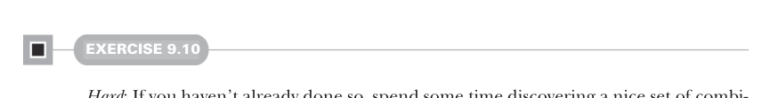

# Страница 0258
[<- Страница 0257](./page-0257) | [Индекс страниц](./) | [Страница 0259 ->](./page-0259)

> Часть 2: Функциональный дизайн и библиотеки комбинаторов / Глава 9: Комбинаторы парсеров / 9.5 Отчёт об ошибках / 9.5.1 Возможный дизайн

## 229 9.5 Отчёт об ошибках

#### УПРАЖНЕНИЕ 9.10

*Сложное*: Если ещё не ковырялся, садись и придумай нормальный набор комбинаторов, чтоб выразить, какие ошибки выдаёт `Parser`. Для каждого комбинатора попробуй сформулировать законы — как эта херня должна себя вести. Задачка полностью на твой вкус, вот вопросы, чтоб мозги размять:

- Дан парсер `string("abra")` `**` `string("` `").many` `**` `string("cadabra")`, а на входе `"abra` `cAdabra"` (заметил заглавную `'A'`?). Какую ошибку хочешь выдать — типа `Expected` `'a'` или `Expected` `"cadabra"`? А если приспичит другую, скажем `"Magic` `word` `incorrect,` `try` `again!"`?

- Дан `a` `or` `b`, если `a` обосрался на входе, всегда ли запускать `b`, или бывают случаи, когда ну его нахуй? Если да, то как комбинаторами дать программисту рулить, когда `or` вообще смотрит на второй парсер?

- Как хочешь хэндлить позицию ошибок в отчёте?

- Дан `a` `|` `b`, если оба `a` и `b` лажают на входе, не охота ли выдать обе ошибки? И всегда ли обе, или дать программисту выбор, какую из двоих пихать?

Когда сам доволен своим дизайном — валяй дальше читать. Следующий раздел разберём один вариант по полочкам.

Комбинаторы задают информацию. В типичном сценарии дизайна библиотеки, где репка уже маячит на горизонте, мы думаем о функциях как о том, как они эту репку перелопатят — будто мясорубка через фарш. А начиная с алгебры, заставляем мозги переключиться: функции — это про то, какую инфу они впаривают возможной имплементации. Сигнатуры диктуют, что передаём, а имплементация волен юзать это как угодно — лишь бы законы не насрал.

### 9.5.1 Возможный дизайн

Теперь, когда ты набросал свои комбинаторы для отчёта об ошибках, разберём один вариант. Твой мог получиться другой — и похуй, это просто ещё один разбор процесса дизайна на живом примере.

[<- Страница 0257](./page-0257) | [Индекс страниц](./) | [Страница 0259 ->](./page-0259)
