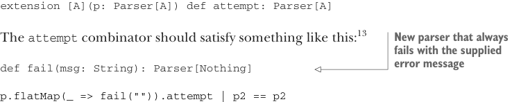

# Страница 0261
[<- Страница 0260](./page-0260) | [Индекс страниц](./) | [Страница 0262 ->](./page-0262)

> Часть 2: Функциональный дизайн и библиотеки комбинаторов / Глава 9: Комбинаторы парсеров / 9.5 Отчёт об ошибках / 9.5.3 Контроль ветвления и бэктрекинга

### 9.5.3 Контроль ветвления и бэктрекинга

Осталась одна хуйня с отчётом об ошибках, которую надо разрулить по-человечески. 

Как мы только что разобрали, когда ошибка вылазит внутри комбинатора `or`, нужен способ решить, какую именно ошибку (или ошибки) выкидывать наружу. Не хотим тупо глобальную конвенцию на все случаи жизни — иногда программисту надо дать руль в руки, чтоб сам выбрал. 

Давай глянем на конкретный пример, который это на пальцах покажет, как в код-ревью пацанам:

```scala
val spaces = string(" ").many
val p1 =
  (string("abra") ** spaces ** string("cadabra")).scope("magic spell")
val p2 =
  (string("abba") ** spaces ** string("babba")).scope("gibberish")
val p = p1 | p2
```

Какую `ParseError` (ошибку парсинга) мы хотим получить от `p.run("abra`cAdabra")`? 
(Опять же, заметь заглавную `A` в `cAdabra` — классическая подстава.) 

Оба ветви `or` на этом инпуте отвалятся с ошибками, как пробки в час пик. 
Парсер с лейблом `"gibberish"` заорёт, что ждал первое слово `"abba"`, 
а парсер `"magic spell"` взвоет из-за случайной заглавной буквы в `"cAdabra"`. 

Какую из этих ошибок скормим юзеру? 
В этот раз нам как раз нужна ошибка парсинга `"magic spell"` — после того, как успешно сожрали слово `"abra"`, мы уже влипли в ветвь `"magic spell"` от `or` по самые яйца, так что при ошибке не ковыряем следующую ветвь `or`, а сразу сдаёмся. 

В других случаях может и захочется дать парсеру шанс на следующую ветвь `or` — типа, "не всё потеряно, братан". 

Короче, нужен примитив, чтоб кодер мог сказать: "тут коммитимся в эту ветку, без бэктрека". 
Помнишь, мы грубо привязали `p1 | p2` к смыслу *попробуй p1 на инпуте, а если фейл — то же с p2*? 
Можем перевернуть: *запускай p1, и если фейл в некоммитнутом стейте — пробуй p2; иначе — сразу орём фейл*. 

Полезно не только для сочных ошибок — перф тоже взлетает, не тратя время на кучу фантомных веток, как в том меме про "parser combinator hell". 

Обычное решение этой хуйни: все парсеры по дефолту коммитятся, если сожрали хотя бы один символ для результата.<sup>12</sup> 
А потом впиливаем комбинатор `attempt` (попытка), который коммит откладывает, как ленивый интерн:

```scala
extension [A](p: Parser[A]) def attempt: Parser[A]
```



Комбинатор `attempt` должен работать примерно так:<sup>13</sup>

> Новый парсер, который всегда фейлит с поданной ошибкой

```scala
def fail(msg: String): Parser[Nothing]
p.flatMap(_ => fail(""))
  .attempt | p2 == p2
```

<sup>12</sup>Смотри заметки к главе (https://github.com/fpinscala/fpinscala/wiki) — там ещё пиздец как подробно разжёвано. 

<sup>13</sup>Это не строго равенство, бля. 
Хотя мы и хотим запустить `p2` при фейле пробного парсера, может статься, что `p2` как-то сольёт ошибки из обеих веток, если сам отвалится — чтоб юзер не в ахуе был.

[<- Страница 0260](./page-0260) | [Индекс страниц](./) | [Страница 0262 ->](./page-0262)
