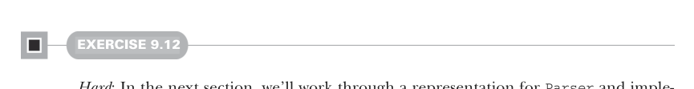

# Страница 0263

[<- Страница 0262](./page-0262) | [Индекс страниц](./) | [Страница 0264 ->](./page-0264)

> Часть 2: Функциональный дизайн и библиотеки комбинаторов / Глава 9: Комбинаторы парсеров / 9.6 Реализация алгебры / 9.6.1 Одна возможная реализация



#### УПРАЖНЕНИЕ 9.12

*Сложное*: В следующей секции мы разберём репрезентацию для `Parser` и реализуем интерфейс `Parsers` на ней. Но сперва сами поковыряйтесь — придумайте идеи. Задачка открытая, как дверь в паб после дедлайна, но наша алгебра — как строгий код-ревьюер, жёстко рамсит все варианты. Должны накидать простую, чисто функциональную репрезентацию `Parser`, чтоб интерфейс `Parsers` завёлся без подвохов.<sup>15</sup>

Ваш код, скорее всего, будет выглядеть примерно так:

```scala
class MyParser[+A](...):
...
object MyParsers extends Parsers[MyParser]:
// implementations of primitives go here
```

Замените `MyParser` на тот дата-тип, который вы слепили для парсеров. Когда надумаете годную хрень, застрянете в дебаге или захотите свежих идей — валите дальше читать.

### 9.6.1 Одна возможная реализация

Теперь разберём одну рабочую имплементацию `Parsers`. Наша парсерная алгебра тянет кучу фич — от базовых до тех, что в проде спасут жопу. Вместо того чтоб сразу запрыгнуть в финальную репрезентацию `Parser`, как в мемный челлендж, будем строить её по кирпичику: глянем на примитивы алгебры и подумаем, какая инфа нужна, чтоб каждый комбинатор не сдох. Начнём с комбинатора `string`:

```scala
def string(s: String): Parser[A]
```

Знаем, что нужно тащить функцию `run`:

```scala
extension [A](p: Parser[A]) def run(input: String): Either[ParseError, A]
```

В первый заход предположим, что наш `Parser` — это просто обёртка вокруг имплементации `run`, без лишней хуйни:

```scala
opaque type Parser[+A] = String => Either[ParseError,A]
```

<sup>15</sup>Заметим: если после имплементации `Parsers` запустите JSON-парсер, может прилететь stack overflow (переполнение стека) — классика, как рекурсия без хвоста в 2024-м. Обсудим в конце следующей секции, чтоб не облажаться.

[<- Страница 0262](./page-0262) | [Индекс страниц](./) | [Страница 0264 ->](./page-0264)
