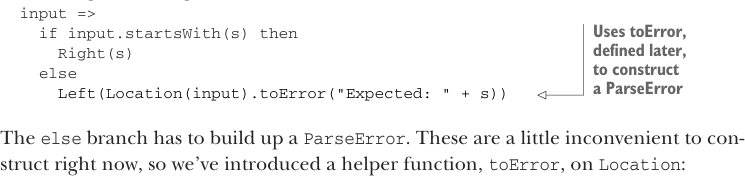
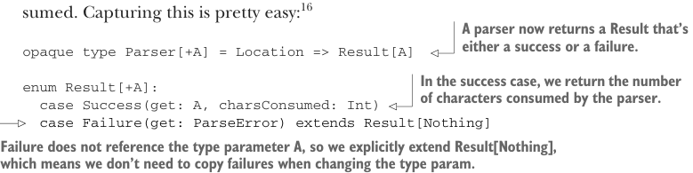

# Страница 0264
[<- Страница 0263](./page-0263) | [Индекс страниц](./) | [Страница 0265 ->](./page-0265)

> Часть 2: Функциональный дизайн и библиотеки комбинаторов / Глава 9: Комбинаторы парсеров / 9.6 Реализация алгебры / 9.6.2 Последовательность парсеров

## 235 9.6 Реализация алгебры

Короче, этим мы реализуем примитив `string`:

```scala
def string(s: String): Parser[A] =
  input =>
    if input.startsWith(s) then
      Right(s)
    else
```



> Использует `toError`, который определим позже, чтоб слепить `ParseError`

```scala
Left(Location(input).toError("Expected: " + s))
```

В ветке `else` приходится собирать `ParseError`. Эти хрени пока неудобно лепить на коленке, так что ввели хелпер `toError` прямо на `Location`:

```scala
case class Location(input: String, offset: Int = 0):
  def toError(msg: String): ParseError =
    ParseError(List((this, msg)))
```

### 9.6.2 Последовательность парсеров

Пока всё заебись. У нас репрезентация для `Parser`, которая хотя бы тянет `string`. Переходим к последовательности парсеров — типа `string("abra") ** string("cadabra")`. К сожалению, текущей схемы не хватит, чтоб это зарепрезентить. Если `"abra"` спарсил успешно, то символы эти мы считаем сожранными — как Пакман на стероидах — и пускаем `"cadabra"` на остаток. Так что для цепочки нужен способ, чтоб `Parser` сигналила, сколько она слопала. Легкотня это ловить.[^16]



> Теперь парсер возвращает `Result` — либо успех, либо облом полный.

```scala
opaque type Parser[+A] = Location => Result[A]
```

> При успехе отдаём, сколько символов парсер слопал.

```scala
enum Result[+A]:
  case Success(get: A, charsConsumed: Int)
  case Failure(get: ParseError) extends Result[Nothing]
```


> `Failure` не лезет в параметр типа `A`, так что явно тянем от `Result[Nothing]` — не придётся дублировать фейлы при смене типа, хаос в проде нам не нужен.

Тут впилили новый тип `Result`, а не голый `Either`. При успехе кидаем значение типа `A` плюс счётчик сожранных символов — коллер сам разберётся, как стейт `Location` подкрутить.[^17] Этот тип уже копает до сути `Parser` — это state action (действие над состоянием) с риском фейла, как мы в шестой главе ковыряли. Берёт стейт на вход, если прокатит — выдаёт значение и подсказку, как стейт апдейтить. Это озарение — что `Parser` просто state action — даёт каркас для репрезентации, которая потянет все эти выебонные комбинаторы и законы из наших обещаний. Просто глянем, что каждый примитив требует от стейта трекать (только `Location`).

[^16]: Помните, `Location` держит полную входную строку и оффсет в неё.

[^17]: Обратите внимание: возврат `(A, Location)` дал бы `Parser` власть менять инпут в `Location`. Это как дать алкашу ключи от пивзавода — перебор!

[<- Страница 0263](./page-0263) | [Индекс страниц](./) | [Страница 0265 ->](./page-0265)
