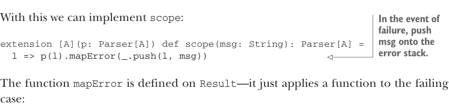

# Страница 0265
[<- Страница 0264](./page-0264) | [Индекс страниц](./) | [Страница 0266 ->](./page-0266)

> Часть 2: Функциональный дизайн и библиотеки комбинаторов / Глава 9: Комбинаторы парсеров / 9.6 Реализация алгебры / 9.6.3 Парсеры с метками


(может и не прокатить) и разберём по косточкам, как каждый комбинатор ковыряет это состояние, как хирург в пациенте.

#### УПРАЖНЕНИЕ 9.13

Забей `string`, `regex`, `succeed` и `slice` для этой сырой версии `Parser`. Кстати, `slice` работает криво по перформансу — лепит значение нахер, а потом в помойку. Вернёмся к этому позже, не ссы.

### 9.6.3 Парсеры с метками

Спускаемся ниже по списку примитивов, берём `scope`. Если обосралось — пушим свежую записку в стек `ParseError`. 
Заводим хелпер на `ParseError`, зовём его `push`<sup>18</sup>:

```scala
case class ParseError(stack: List[(Location, String)] = Nil):
def push(loc: Location, msg: String): ParseError =
copy(stack = (loc, msg) :: stack)
```



С этим уже можно забить `scope`:

> При фейле пушим msg в стек ошибок.

```scala
extension [A](p: Parser[A]) def scope(msg: String): Parser[A] =
l => p(l).mapError(_.push(l, msg))
```

Функция `mapError` живёт на `Result` — просто лепит функцию к кейсу провала:

```scala
def mapError(f: ParseError => ParseError): Result[A] = this match
case Failure(e) => Failure(f(e))
case _ => this
```

Пушим в стек _после_ возврата внутреннего парсера, так что внизу стека окажутся самые сочные детали с конца парсинга — как в логе, где свежак сверху, а древние грехи на дне. 
Например, если `` `(a ** b.scope(msg2)).scope(msg1)` `` фейлит на `b`, то первый в стеке будет `msg1`, за ним — косяки от `a`, потом `msg2`, и в конце — от `b`. 
`label` забьём похожим манером, но вместо пуша — реплеисим то, что уже там. Опять через `mapError`:


> Вызывает хелпер на ParseError, который тоже label зовётся

```scala
extension [A](p: Parser[A]) def label(msg: String): Parser[A] =
l => p(l).mapError(_.label(msg))
```

<sup>18</sup> Метод `copy` идёт в комплекте с любым `case class` — фришник от Скалы. 
Возвращает копию объекта, но с апдейтами полей. Не трогаешь поле — оставляет как в оригинале. 
Под капотом — обычные дефолтные аргументы Скалы, ничего сверхъестественного.

[<- Страница 0264](./page-0264) | [Индекс страниц](./) | [Страница 0266 ->](./page-0266)
