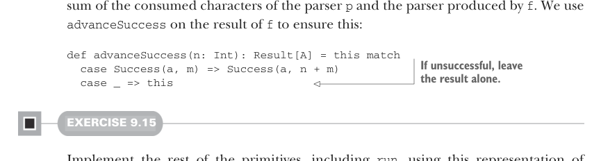
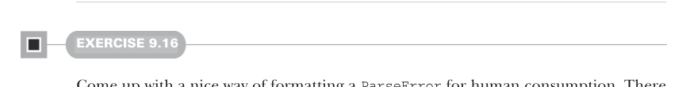
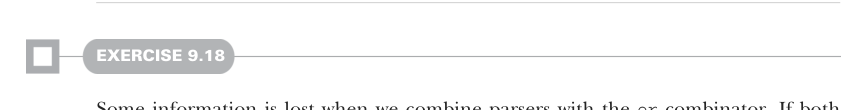

# Страница 0268
[<- Страница 0267](./page-0267) | [Индекс страниц](./) | [Страница 0269 ->](./page-0269)

> Часть 2: Функциональный дизайн и библиотеки комбинаторов / Глава 9: Комбинаторы парсеров / 9.6 Реализация алгебры / 9.6.5 Парсинг с учётом контекста

## 239 9.6 Реализация алгебры



сумма сожранных символов парсера ``p`` и того парсера, что выдал ``f``. Чтоб это проскочило без косяков, мы ``advanceSuccess``'им результат от ``f``:

```scala
def advanceSuccess(n: Int): Result[A] = this match
case Success(a, m) => Success(a, n + m)
case _ => this
```

> Если не выстрелило — оставь результат в покое, не трогай.

#### УПРАЖНЕНИЕ 9.15

Допили остальные примитивы, включая ``run``, на базе этой репрезентации ``Parser`, и прогоняй свой JSON-парсер по всякому дерьму. Увидишь, к сожалению, как на жирных инпутах (типа ``[1,2,3,...10000]``) стек рвёт жопу оверфлоуом. Простой хак — спец-имплементация ``many``, чтоб не жрала стек на каждый элемент списка. Пока все повторялки дефайнятся через ``many`` (а они все так могут, без вопросов), проблема в жопе.



#### УПРАЖНЕНИЕ 9.16

Придумай годный способ форматировать ``ParseError`` для человеческого глаза. Вариантов дохуя, но ключевой инсайт — лейблы с одного места группировать или комбайнить, когда ошибка вываливается как ``String`` на дисплей.


#### УПРАЖНЕНИЕ 9.17

*Хардкор*: Комбинатор ``slice`` всё ещё тупит по производительности. Например, ``char('a').many.slice`` наворотит ``List[Char]``, а потом сольёт в унитаз. Есть ли способ подкрутить репрезентацию ``Parser``, чтоб слайсинг летал как ракета?



#### УПРАЖНЕНИЕ 9.18

При склейке парсеров через ``or`` инфа улетает в никуда. Если оба обосрались, держим только ошибки второго. А надо показывать оба месседжа или хватать ошибку от того, кто дальше дополз без фейла. Переделай репрезентацию ``ParseError``, чтоб трекала ошибки из других веток парсера.

[<- Страница 0267](./page-0267) | [Индекс страниц](./) | [Страница 0269 ->](./page-0269)
