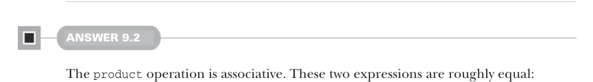

# Страница 0270

[<- Страница 0269](./page-0269) | [Индекс страниц](./) | [Страница 0271 ->](./page-0271)

> Часть 2: Функциональный дизайн и библиотеки комбинаторов / Глава 9: Комбинаторы парсеров / 9.8 Ответы на упражнения

## 241 9.8 Ответы на упражнения


### 9.8 Ответы на упражнения

#### ОТВЕТ 9.1

Берём продукт от `p` и `p2` — и вуаля, у нас `Parser[(A,` `B)]`, как два Lego-блока слепились в парный монстр. Потом маппим по вашей ф-ции `f` — и получаем чистенький `Parser[C]`, без лишней хуйни:

```scala
extension [A](p: Parser[A])
def map2[B, C](p2: Parser[B])(f: (A, B) => C): Parser[C] =
p.product(p2).map((a, b) => f(a, b))
```

Чтобы заимплементить `many1`, юзаем `map2` — склеиваем результаты `p` и `p.many` в один список, конся результат `p` к результату `p.many`, классика cons'а, как в старые добрые времена, когда FP ещё не был таким жирным:

```scala
extension [A](p: Parser[A])
def many1: Parser[List[A]] =
p.map2(p.many)(_ :: _)
```



#### ОТВЕТ 9.2

Операция `product` ассоциативна, пацаны, как склейка пар в бесконечной цепочке — порядок вложенности не ебёт итог. Эти два выражения примерно равны, разница только в том, как пары посидели:

```scala
(a ** b) ** c
a ** (b ** c)
```

Единственная подлянка — в nested парах: `(a` `**` `b)` `**` `c` парсер выдаёт `((A,` `B),` `C)`, а `a` `**` `(b` `**` `c)` — `(A,` `(B,` `C))`. Пишем ф-ции `unbiasL` и `unbiasR`, чтоб эти кривые nested tuples выровнять в плоские 3-туплы, без этой tuple-иерархии, как в матрице из трёхмерного Lego:

```scala
def unbiasL[A, B, C](p: ((A, B), C)): (A, B, C) = (p(0)(0), p(0)(1), p(1))
def unbiasR[A, B, C](p: (A, (B, C))): (A, B, C) = (p(0), p(1)(0), p(1)(1))
```

С ними ассоциативность чётко формулируется, без двусмысленностей:

```scala
((a ** b) ** c).map(unbiasL) == (a ** (b ** c)).map(unbiasR)
```

Иногда мы просто лепим `~=`, когда бидекция между сторонами очевидна, как два и два — четыре, нечего тут выёбываться:

```scala
(a ** b) ** c ~= a ** (b ** c)
```

`map` и `product` тоже в интересных отношениях — можно `map` хоть до, хоть после продукта двух парсеров, поведение не изменится ни на йоту, чистая коммутативность, как в школьной алгебре, только без ошибок на проде:

```scala
a.map(f) ** b.map(g) == (a ** b).map((a,b) => (f(a), g(b)))
```

[<- Страница 0269](./page-0269) | [Индекс страниц](./) | [Страница 0271 ->](./page-0271)
