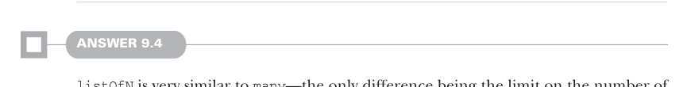
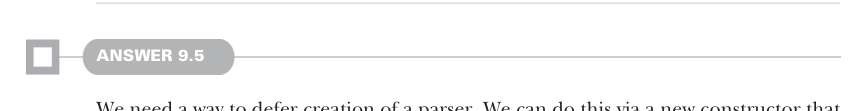

# Страница 0271

[<- Страница 0270](./page-0270) | [Указатель страниц](./) | [Страница 0272 ->](./page-0272)

> Часть 2: Функциональный дизайн и библиотеки комбинаторов / Глава 9: Комбинаторы парсеров / 9.8 Ответы на упражнения

Например, если бы `a` и `b` оба были `Parser[String]`, а `f` и `g` оба считали длину строки, то похуй было бы, маппим ли мы по результату `a` для подсчёта длины или валяем это после продукта — как в той классической коммутативности, где порядок не ебёт мозги. Подробнее про эти законы — в главе 12, там разжёвываем как на код-ревью.


#### ОТВЕТ 9.3

Юзаем тот же трюк, что и для `many1` в упражнении 9.1: `map2` с cons'ом лепим список по кирпичику. Когда это накрывается пиздецом — инпут кончился или ещё какая хуйня — мы чётко возвращаем пустой список и не парься:

```scala
extension [A](p: Parser[A])
def many: Parser[List[A]] =
p.map2(p.many)(_ :: _) | succeed(Nil)
```

Но вот засада в этой имплементации, блядь: рекурсивно дёргаем `p.many`, а наша `map2` жрёт аргумент строго, как пылесос, — и привет, стек-оверфлоу, будто в 2005-м на JVM без хвостовой рекурсии. Чтобы не обосраться, надо переделать `map2` под ленивый приём парсер-аргумента. Разберём это поглубже в следующей секции главы, не ссыте.



#### ОТВЕТ 9.4

`listOfN` — это почти клон `many`, единственная разница в лимите на пачку элементов для парсинга, как в том меме про "ещё один, и хватит". Потому лепим похожий подход: `map2` с рекурсивным вызовом `listOfN(n` `-` `1)` на каждой итерации, чтоб не улететь в бесконечность. Как только `n` добирается до нуля — бац, успех с пустым списком, чисто и без соплей:

```scala
extension [A](p: Parser[A])
def listOfN(n: Int): Parser[List[A]] =
if n <= 0 then succeed(Nil)
else p.map2(p.listOfN(n - 1))(_ :: _)
```



#### ОТВЕТ 9.5

Нам охота способ оттянуть создание парсера на потом, чтоб не жрало стек заранее, как ленивый кот мятой. Делаем через свежий конструктор, который жрёт парсер by-name и валит его оценку до самого парсинга — классика FP, чтоб избежать строгой жадности:

```scala
def defer[A](p: => Parser[A]): Parser[A]
```

[<- Страница 0270](./page-0270) | [Указатель страниц](./) | [Страница 0272 ->](./page-0272)
