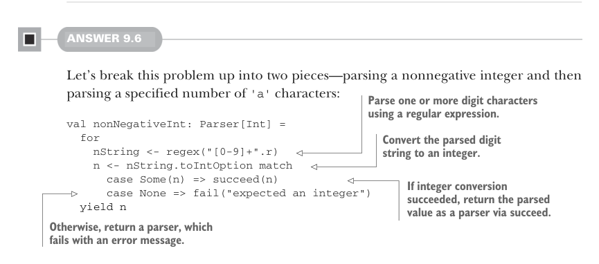
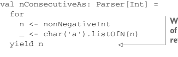

# Страница 0272

[<- Страница 0271](./page-0271) | [Индекс страниц](./) | [Страница 0273 ->](./page-0273)

> Часть 2: Функциональный дизайн и библиотеки комбинаторов / Глава 9: Комбинаторы парсеров / 9.8 Ответы на упражнения

## 243 9.8 Ответы на упражнения

Короче, реализацию `defer` мы не ковыряем. Допустим, это базовый примитив, 
который подкинут имплементациями трейта `Parsers`.<sup>19</sup>

```scala
extension [A](p: Parser[A])
def many: Parser[List[A]] =
p.map2(defer(p.many))(_ :: _) | succeed(Nil)
```

В главе про параллелизм мы конкретно парились, чтоб не плодить `Par`, 
которые жрут время и память, как последовательный компьютинг (serial computing), 
— полная жопа. А комбинатор `delay` давал контроль поточнее, без этой хуйни. 
Здесь это не такая боль, и каждый раз при `map2` ебаться мозгами, звать ли `defer`, 
— лишний фрикшн (friction) для юзеров API, бля.



#### ОТВЕТ 9.6

Давай эту задачку порежаем на два куска — парсим неотрицательный инт, 
а потом указанное число `'a'` символов:

> Парсим одну или больше цифр через регулярку.

```scala
val nonNegativeInt: Parser[Int] =
for
nString <- regex("[0-9]+".r)
n <- nString.toIntOption match
case Some(n) => succeed(n)
case None => fail("expected an integer")
yield n
```

> Конвертим спарсенную строку цифр в инт.

> Если конверт сработал — возвращаем значение через `succeed` как парсер. 
> Иначе — парсер, который всегда фейлится с ошибкой.

Мы юзнули `flatMap` на регекс-парсере для доп. валидации и трансформации 
— тут стринг в инт. Пришлось слепить новый примитив `fail`, 
который строит парсер, всегда фейлящийся с поданной ошибкой. 
А с `nonNegativeInt` можно через `flatMap` закомбинировать 
уже знакомые нам примочки для `nConsecutiveAs`:

```scala
val nConsecutiveAs: Parser[Int] =
for
n <- nonNegativeInt
_ <- char('a').listOfN(n)
yield n
```



> Мы выбрали возвращать число спарсенных 'a' вместо самой строки — короче и по делу.

<sup>19</sup>Альтернативно, можно было бы `defer` из `succeed` и `flatMap` слепить, 
но `flatMap` мы определяем позже в главе, не торопись, ха-ха.

[<- Страница 0271](./page-0271) | [Индекс страниц](./) | [Страница 0273 ->](./page-0273)
