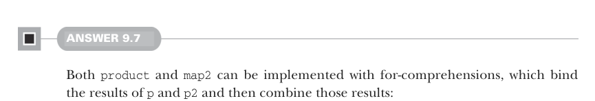
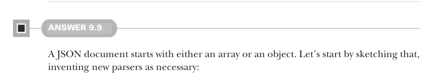

# Страница 0273

[<- Страница 0272](./page-0272)  
[Указатель страниц](./)  
[Страница 0274 ->](./page-0274)

> Часть 2: Функциональный дизайн и библиотеки комбинаторов /  
> Глава 9: Комбинаторы парсеров /  
> 9.8 Ответы на упражнения



#### ОТВЕТ 9.7

Пацаны, и `product`, и `map2` — это чисто for-comprehensions (for-выражения) в своей стихии:  
биндят результаты `p` и `p2`, как монада на стероидах, а потом мешают их в один убойный результат,  
чтоб не ебаться с flatMap вручную:

```scala
extension [A](p: Parser[A])
def product[B](p2: => B): Parser[(A, B)] =
for
a <- p
b <- p2
yield (a, b)
def map2[B, C](p2: => B)(f: (A, B) => C): Parser[C] =
for
a <- p
b <- p2
yield f(a, b)
```


#### ОТВЕТ 9.8

`map` лепим на коленке из `flatMap` и `succeed` — классика, как леворекурсия (left-recursion) в парсере,  
только без боли:

```scala
extension [A](p: Parser[A])
def map[B](f: A => B): Parser[B] =
p.flatMap(a => succeed(f(a)))
```



#### ОТВЕТ 9.9

JSON-документ стартует либо с массива, либо с объекта — как вечеринка, где либо толпа в скобках,  
либо элита в фигурных. Накидаем скелет, выдумывая парсеры на лету, чтоб не мучаться:

```scala
def document: Parser[JSON] = array | obj
def array: Parser[JSON] = ???
def obj: Parser[JSON] = ???
```

А теперь срежем весь этот белый шум в начале документа — пробелы, табы, переносы,  
чтоб парсер не спотыкался, как пьяный на код-ревью. Пишем парсер для whitespace (пробелов, табов и переносов)  
и цепляем его к `array` `|` `obj`, типа префиксного фильтра:

```scala
def whitespace: Parser[String] = Parser.regex("\\s*".r)
def document: Parser[JSON] = whitespace.map2(array | obj)((_, doc) => doc)
```

[<- Страница 0272](./page-0272)  
[Указатель страниц](./)  
[Страница 0274 ->](./page-0274)
