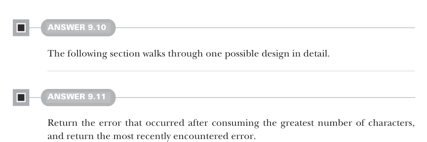
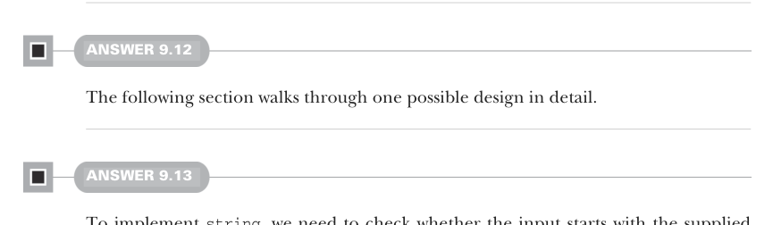
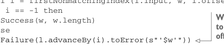

# Страница 0276
[<- Страница 0275](./page-0275) | [Индекс страниц](./) | [Страница 0277 ->](./page-0277)

> Часть 2: Функциональный дизайн и библиотеки комбинаторов / Глава 9: Комбинаторы парсеров / 9.8 Ответы на упражнения

## 247 9.8 Ответы на упражнения



#### ОТВЕТ 9.10

Дальше разберём один возможный дизайн по косточкам, чтоб ты не влетел в классическую парсерную яму.

#### ОТВЕТ 9.11

Возвращай ошибку, которая вылезла после максимального сожрания символов — типа, парсер дошёл furthest по пути, как упёртый танк, и вторым вариантом хватай самую свежую хрень, которую словил на последнем шаге.



#### ОТВЕТ 9.12

Дальше пройдёмся по одному из вариантов дизайна в деталях, без воды и с подвохами на виду.

#### ОТВЕТ 9.13

Чтобы заимплементить `string`, проверяем, стартует ли инпут с поданной строки, а если нет — выдаём ошибку с указанием, какой именно символ не сошёлся, чтоб не гадать потом. Хелпер `firstNonmatchingIndex` под это заточим. Детали `firstNonmatchingIndex` тут опустим — загляни в гитхаб-репозиторий за полной имплементацией, не ленись:

```scala
def firstNonmatchingIndex(s1: String, s2: String, offset: Int): Int = ...
def string(w: String): Parser[String] =
l =>
val i = firstNonmatchingIndex(l.input, w, l.offset)
if i == -1 then
Success(w, w.length)
else
```



> В Location закинули метод advanceBy, который прокачивает оффсет на заданный кусок — без него никуда, классика.

```scala
Failure(l.advanceBy(i).toError(s"'$w'"))
```

Чтобы заимплементить `regex`, юзаем стоковый `findPrefixOf` на `Regex`, впаривая ему остаток инпута — никаких колхозов. Остаток всегда под рукой через `l.input.substring` `(l.offset)`:

```scala
def regex(r: Regex): Parser[String] =
l => r.findPrefixOf(l.input.substring(l.offset)) match
case Some(m) => Success(m, m.length)
case None => Failure(l.toError(s"regex $r"))
```

[<- Страница 0275](./page-0275) | [Индекс страниц](./) | [Страница 0277 ->](./page-0277)
