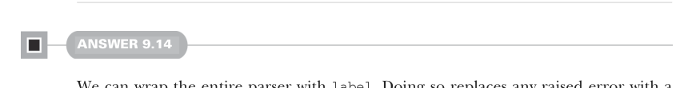
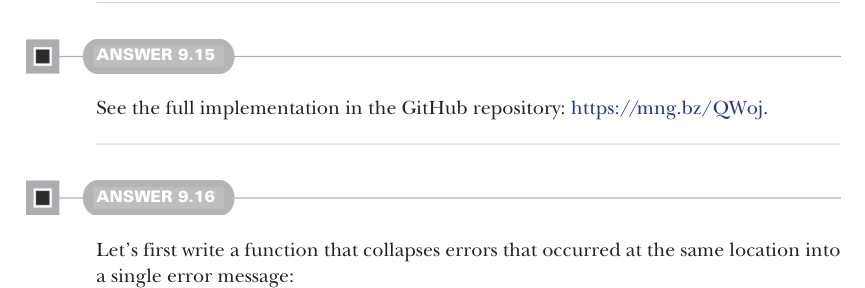

# Страница 0277

[<- Страница 0276](./page-0276) | [Индекс страниц](./) | [Страница 0278 ->](./page-0278)

> Часть 2: Функциональный дизайн и библиотеки комбинаторов / Глава 9: Комбинаторы парсеров / 9.8 Ответы на упражнения

Реализация `succeed` — проще пареной репы: мы полностью плюём на инпут, лепим `Success` с нужным значением и флагом, что ни хуя не сожрали:

```scala
def succeed[A](a: A): Parser[A] =
  _ => Success(a, 0)
```

Наконец, `slice` — это вообще кайф: гоняем обёрнутый парсер, и если прокатило, откусываем от оригинального инпута ровно столько символов, сколько он слопал, начиная с текущего оффсета, как лазерная резка по живому:

```scala
extension [A](p: Parser[A])
  def slice: Parser[String] =
    l => p(l) match
      case Success(_, n) =>
        Success(l.input.substring(l.offset, l.offset + n), n)
      case f @ Failure(e) => f
```



#### ОТВЕТ 9.14

Оборачиваем весь парсер в `label` — и любая подлая ошибка превращается в дружелюбное «давай, неотрицательное целое (nonnegative integer) давай, не томи». Хочешь сохранить оригинальный сок ошибки — юзай `scope`, чтоб не потерять нюансы:

```scala
val nonNegativeIntOpaque: Parser[Int] =
  nonNegativeInt.label("non-negative integer")
```



#### ОТВЕТ 9.15

Полную реализацию ковыряй в GitHub-репозитории: https://mng.bz/QWoj.

#### ОТВЕТ 9.16

Сначала замутим функцию, которая сольёт все ошибки с одной позиции в одно связное (coherent) сообщение — типа, не плодить сущностей, а сжать в один кулак боли:

```scala
def collapseStack(s: List[(Location, String)]): List[(Location, String)] =
  s.groupBy(_(0))
    .view
    .mapValues(_.map(_(1)).mkString("; "))
    .toList
    .sortBy(_(0).offset)
```

[<- Страница 0276](./page-0276) | [Индекс страниц](./) | [Страница 0278 ->](./page-0278)
