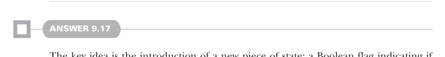

# Страница 0278
[<- Страница 0277](./page-0277) | [Индекс страниц](./) | [Страница 0279 ->](./page-0279)

> Часть 2: Функциональный дизайн и библиотеки комбинаторов / Глава 9: Комбинаторы парсеров / 9.8 Ответы на упражнения

## 249. 9.8 Ответы на упражнения

Мы хапнули функцию `groupBy`, чтоб слепить `Map[Location, List[(Location, String)]]` — как один большой пельмень из мелких. 
Потом в каждой вложенной подсписке выкидываем дублирующийся `Location`, склеиваем сообщения об ошибках через точку с запятой, чтоб не путаться в этом бардаке. 
Наконец, превращаем в список, сортируем по локации — и вуаля, ошибки идут строго по порядку их появления во входной строке, как в жизни, без этой imperative хуйни. 
А теперь впихнём эту вкуснятину в имплементацию `toString` для `ParseError`:

```scala
override def toString: String =
if stack.isEmpty then "no error message"
else
val collapsed = collapseStack(stack)
val context =
collapsed.lastOption.map("\n\n" + _(0).currentLine).getOrElse("") +
collapsed.lastOption.map("\n" + _(0).columnCaret).getOrElse("")
collapsed.map((loc, msg) =>
s"${formatLoc(loc)} $msg").mkString("\n") + context
```

Эта имплементация выводит каждую ошибку из свёрнутого списка с номером строки и колонкой, где она вылезла. 
Для топовой ошибки в стеке — кидаем саму входную строку, которая не спарсилась, и зазнaчкой (^, caret) тыкаем прямо в проблемный символ, чтоб даже джуниор сразу увидел, где собака зарыта. 
Юзает пару утилиток; полный код с мясом в Git-репозитории: http://mng.bz/4jPV.



#### ОТВЕТ 9.17

Фишка в новом куске стейта: булевый флаг, который орёт "я в `slice` (срезе), мой результат можно смело выебать в помойку". 
Чтоб это провернуть, заводим свежий тип для стейта:

```scala
case class ParseState(loc: Location, isSliced: Boolean)
```

Потом перекраиваем определение парсера под этот новый стейт — классика, когда стейт эволюционирует (evolves), чтоб не переписывать весь пайплайн:

```scala
opaque type Parser[+A] = ParseState => Result[A]
```

Ещё добавляем свежий кейс в тип результата: теперь это не просто успех с `A` или фейл, а срез (slice) входа — как кусок пиццы вместо всей. 
Для этого превращаем `Result` из простого перечисления (enum) в `sealed trait` с подтипами под каждый случай, чтоб типы нас не подставили:

```scala
sealed trait Result[+A]
case class Success[+A](get: A, length: Int) extends Result[A]
case class Failure(
get: ParseError, isCommitted: Boolean) extends Result[Nothing]
case class Slice(length: Int) extends Result[String]
```

[<- Страница 0277](./page-0277) | [Индекс страниц](./) | [Страница 0279 ->](./page-0279)
