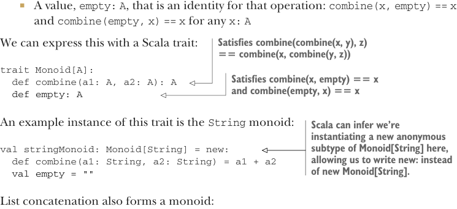

# Страница 0285

[<- Страница 0284](./page-0284) | [Индекс страниц](./) | [Страница 0286 ->](./page-0286)

> Часть 3: Общие структуры в функциональном дизайне / Глава 10: Моноиды / 10.1 Что такое моноид?

Мы стартуем с моноидов, потому что они простые, как валенок, повсюду торчат, как тараканы в общаге, и реально выручают в бою. Моноиды выныривают в коде каждый день, даже если ты и не чухнул, что это они. Списки мутить, строки клеить, результаты циклов накапливать — всё это моноидная тема под капотом. Покажем, как они рулят по-крупному: дают свободу рвать задачу на параллельные куски, чтоб процессоры не дрочили вхолостую, и компонуются, как лего, из простых блоков в монстра-расчёты.

### 10.1 Что такое моноид?

Давайте разберём алгебру конкатенации строк — классика, блядь. Складываем `"foo" + "bar"` и бац — `"foobar"`. Пустая строка — это *единичный элемент* (identity element) для такой операции, как ноль для сложения: `s + ""` или `"" + s` — и всегда `s`, без вариантов. Плюс, если три строки клеим: `r + s + t`, то операция *ассоциативная* (associative) — скобки не ебут мозги: `((r + s) + t)` или `r + (s + t)` — похуй, результат один. Те же правила для сложения интов: ассоциативно, `(x + y) + z` равно `x + (y + z)`, и единица — `0`, которая нихуя не меняет. Умножение — то же дерьмо, только единица `1`. Булевы `&&` и `||` ассоциативны, с единицами `true` и `false` соответственно. Это только вершина айсберга, а такие алгебры — везде, как баг в legacy-коде. Называется это *моноид* (monoid), а законы ассоциативности и единицы — *моноидные законы* (monoid laws). Моноид — это:

- Какой-то тип `A`

- Ассоциативная бинарная операция `combine`, которая два `A` в один превращает:  
  `combine(combine(x, y), z) == combine(x, combine(y, z))`  
  для любых `x: A, y: A, z: A`



- Значение `empty: A` — единица для операции:  
  `combine(x, empty) == x` и `combine(empty, x) == x`  
  для любого `x: A`

> Удовлетворяет `combine(combine(x, y), z) == combine(x, combine(y, z))`

В Scala это трейт, который сам просится на язык:

```scala
trait Monoid[A]:
  def combine(a1: A, a2: A): A
  def empty: A
```

> Удовлетворяет `combine(x, empty) == x` и `combine(empty, x) == x`

Пример инстанса — моноид для `String`:

> Scala сам чухает, что мы анонимный подтип `Monoid[String]` лепим, так что `new` вместо `new Monoid[String]` — чистый кайф.

```scala
val stringMonoid: Monoid[String] = new:
  def combine(a1: String, a2: String) = a1 + a2
  val empty = ""
```

Конкатенация списков — тоже моноид, классика жанра:

```scala
def listMonoid[A]: Monoid[List[A]] = new:
  def combine(a1: List[A], a2: List[A]) = a1 ++ a2
  val empty = Nil
```

[<- Страница 0284](./page-0284) | [Индекс страниц](./) | [Страница 0286 ->](./page-0286)
