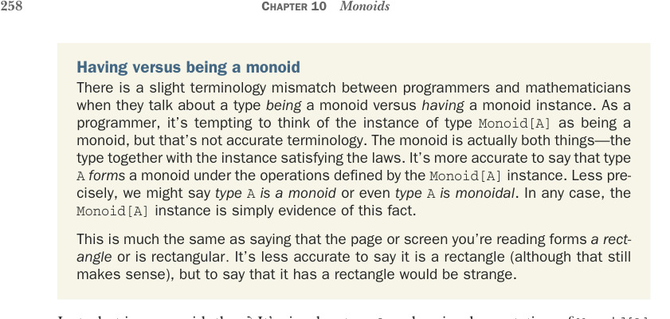

# Страница 0287
[<- Страница 0286](./page-0286) | [Индекс страниц](./) | [Страница 0288 ->](./page-0288)

> Часть 3: Общие структуры в функциональном дизайне / Глава 10: Моноиды / 10.2 Свёртка списков с моноидами



Иметь моноид versus быть моноидом. Тут лёгкий термино-раздрай между прогерами и математиками, когда они треплются о типе, который *является* моноидом versus *имеет* экземпляр моноида. Как типичный прогер, так и подманивает подумать, что экземпляр типа `Monoid[A]` — это и есть моноид сам по себе, но это неточная херня в терминологии. Моноид — это на деле обе вещи вместе: тип плюс экземпляр, который законы держит как надо. Точнее базарить, что тип `A` *формирует* моноид под операциями из экземпляра `Monoid[A]`. Менее строго — *тип `A` это моноид* или даже *тип `A` моноидальный*. Короче, экземпляр `Monoid[A]` — просто улика, что так оно и есть.

Это как сказать, что страница или экран, который ты сейчас пялишься, *формирует* прямоугольник или *прямоугольный*. Неточно — *это прямоугольник* (хотя и это прокатывает), но заявить, что у него *есть прямоугольник внутри*, — это уже как бред сумасшедшего геометра.

Так в чём соль моноида, бля? Просто тип `A` и реализация `Monoid[A]`, которая законы не ломает. Коротко и по делу: моноид — это тип с бинарной операцией (`combine`) над ним, ассоциативной, плюс нейтральный элемент (`empty`). А что это нам сулит? Как любая абстракция в нашем FP-цирке, моноид ценен тем, насколько мы можем накатать годный generic-код, зная только то, что абстракция позволяет. Можем ли мы слепить крутые проги, не зная о типе нихуя, кроме того, что он моноид формирует? Легко, пацаны! Ща разберём примеры на костях.

### 10.2 Свёртка списков с моноидами

Моноиды с листами — как братаны из одного подвала, не разлей вода. Глянь на сигнатуры `fold-`, `Left` и `foldRight` в `List` — аргументы там такие, что аж глаз режет:

```scala
def foldRight[B](acc: B)(f: (A, B) => B): B
def foldLeft[B](acc: B)(f: (B, A) => B): B
```

А если A и B — один и тот же тип?

```scala
def foldRight(acc: A)(f: (A, A) => A): A
def foldLeft(acc: A)(f: (A, A) => A): A
```

Компоненты моноида ложатся на эти сигнатуры как native-перчатка на потную ладонь после дедлайна. Так что если у тебя список строк, то просто впихиваешь `combine` и `empty` из `string-` `Monoid` в свёртку — и вуаля, все строки слеплены в одну жирную:

```scala
scala> val words = List("Hic", "Est", "Index")
words: List[String] = List(Hic, Est, Index)
scala> val s = words.foldRight(stringMonoid.empty)(stringMonoid.combine)
s: String = "HicEstIndex"
scala> val t = words.foldLeft(stringMonoid.empty)(stringMonoid.combine)
t: String = "HicEstIndex"
```

[<- Страница 0286](./page-0286) | [Индекс страниц](./) | [Страница 0288 ->](./page-0288)
