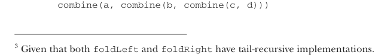

# Страница 0288
[<- Страница 0287](./page-0287) | [Индекс страниц](./) | [Страница 0289 ->](./page-0289)

> Часть 3: Общие структуры в функциональном дизайне / Глава 10: Монойды / 10.3 Ассоциативность и параллелизм

## 259 10.3 Ассоциативность и параллелизм

Заметим, похуй, `foldLeft` ты берёшь или `foldRight` при свёртке с монойдом³ — результат один и тот же должен вылезти.  
Именно потому, что законы ассоциативности и нейтрального элемента держатся как надо.  
Левый фолд склеивает операции слева направо, а правый — справа налево, с юнитом слева или справа соответственно:

```scala
words.foldLeft("")(_ + _)
== (("" + "Hic") + "Est") + "Index"
words.foldRight("")(_ + _) == "Hic" + ("Est" + ("Index" + ""))
```

Можем набросать общую функцию `combineAll`, которая сворачивает список с монойдом:

```scala
def combineAll[A](as: List[A], m: Monoid[A]): A =
as.foldLeft(m.empty)(m.combine)
```

А если элементы списка без инстанса `Monoid`? Да херня, всегда можно `map` по списку, чтоб превратить в тип, где монойд есть:


```scala
def foldMap[A, B](as: List[A], m: Monoid[B])(f: A => B): B
```

#### УПРАЖНЕНИЕ 10.5

Реализуй `foldMap`.

#### УПРАЖНЕНИЕ 10.6

*Сложное*: Функцию `foldMap` можно слепить либо через `foldLeft`, либо через `foldRight`, но также `foldLeft` и `foldRight` можно выкатить через `foldMap`. Попробуй, не ссы!

### 10.3 Ассоциативность и параллелизм

Ассоциативность операции монойда — это как скобки в матане, где похуй, как группируешь, результат не меняется, — позволяет выбирать, как сворачивать структуру вроде списка.  

Уже видели, как ассоциировать слева или справа для последовательной редукции через `foldLeft` или `foldRight`. Но с монойдом можно закатить *сбалансированный фолд*, который для некоторых операций быстрее летает и параллелизм впихнуть позволяет — чтоб на больших данных не тормозить, как старый жёсткий диск.  

Допустим, последовательность `a, b, c, d` сворачиваем каким-нибудь монойдом. Правый фолд скомкает `a, b, c` и `d` вот так:



```scala
combine(a, combine(b, combine(c, d)))
```

³ Учитывая, что и `foldLeft`, и `foldRight` хвостово-рекурсивные на деле.

[<- Страница 0287](./page-0287) | [Индекс страниц](./) | [Страница 0289 ->](./page-0289)
