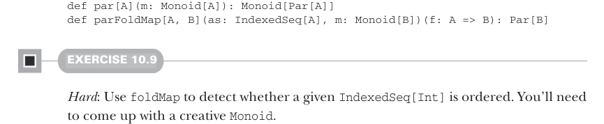

# Страница 0290
[<- Страница 0289](./page-0289) | [Индекс страниц](./) | [Страница 0291 ->](./page-0291)

> Часть 3: Общие структуры в функциональном дизайне / Глава 10: Монойды / 10.4 Пример: Параллельный парсинг

## 261 10.4 Пример: Параллельный парсинг


#### УПРАЖНЕНИЕ 10.8

*Hard*: Реализуй параллельную версию `foldMap` с использованием библиотеки из главы 7. Подсказка: Сделай `par` — комбинатор, который поднимает `Monoid[A]` в контекст `Monoid` `[Par[A]]`,5 — и потом используй это для реализации `parFoldMap`:

```scala
import fpinscala.parallelism.Nonblocking.*
```



```scala
def par[A](m: Monoid[A]): Monoid[Par[A]]
def parFoldMap[A, B](as: IndexedSeq[A], m: Monoid[B])(f: A => B): Par[B]
```

#### УПРАЖНЕНИЕ 10.9

*Hard*: Используй `foldMap`, чтоб проверить, отсортирована ли данная `IndexedSeq[Int]`. Придётся выдумать креативный `Monoid`.

### 10.4 Пример: Параллельный парсинг

Возьмём nontrivial кейс, чтоб не было скучно: посчитать количество слов в `String`. Простая парсерская херня на первый взгляд. Сканируем строку посимвольно, ловим пробелы, считаем последовательности непробельных символов — и вуаля. Последовательно это вообще детский сад: состояние парсера — просто флаг, был ли последний символ пробелом или нет. Но представь, что не короткая строчка, а огромный текстовый файл, который в память одной машины не влезет, как слон в Mini Cooper. Хочется жрать его чанками параллельно, чтоб не тормозить. Стратегия: рубим файл на куски, прокачиваем несколько параллельно, потом склеиваем результаты. Тут состояние парсера усложняется чуток, и комбайн промежуточных результатов должен работать везде — начало файла, середина или жопа — без разницы. Короче, комбайн ассоциативный, как в монойде, чтоб не ебаться с порядком. Для конкретики возьмём короткую строку и притворимся, что это гигантский лог:

```scala
"lorem ipsum dolor sit amet, "
```

Если рубим её пополам, то запросто можем порезать слово посередине. У нас выйдет `"lorem` `ipsum` `do"` и `"lor` `sit` `amet,` `"`. Складываем счётчики слов из этих кусков — и чтоб не насчитать лишний `dolor` дважды, блядь. Ясно, что голый счётчик как `Int` тут не прокатит. Мы

5 Возможность поднять `Monoid` в контекст `Par` обсудим подробнее в главах 11 и 12.

[<- Страница 0289](./page-0289) | [Индекс страниц](./) | [Страница 0291 ->](./page-0291)
