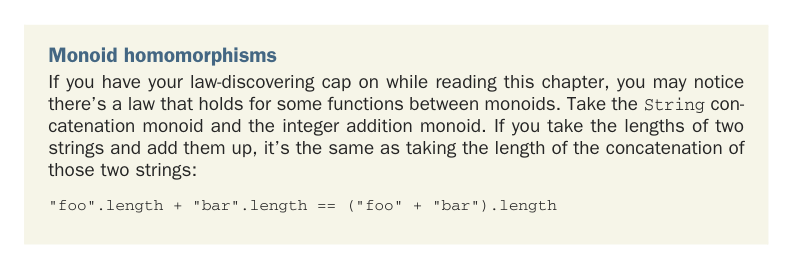

# Страница 0291
[<- Страница 0290](./page-0290) | [Индекс страниц](./) | [Страница 0292 ->](./page-0292)

> Часть 3: Общие структуры в функциональном дизайне / Глава 10: Монойды / 10.4 Пример: Параллельный парсинг

Нам нужна структура данных, которая не будет срать кирпичами от частичных результатов — типа этих обрубков слов `do` и `lor`, — и при этом держит в уме все полные слова, которые уже проскочили, как `ipsum`, `sit` и `amet`. Частичный результат подсчёта слов можно засунуть в ADT, который сам себя объяснит:

```scala
enum WC:
case Stub(chars: String)
case Part(lStub: String, words: Int, rStub: String)
```

`Stub` — это базовый случай, когда полных слов ещё нихуя не накопали. А `Part` тащит счётчик реально целых слов в `words`. `lStub` держит левый огрызок слова перед ними, а `rStub` — правый. Например, считаем по строке `"lorem ipsum do"` — выходит `Part("lorem", 1, "do")`, потому что одно слово точно целое: `"ipsum"`. А `lorem` слева без пробела и `do` справа тоже — хз, целые ли они, так что пока не считаем, чтоб не наебать. По `"lor sit amet,"` выйдет `Part("lor", 2, "")`.


#### УПРАЖНЕНИЕ 10.10

Стукни инстанс монойда для `WC` и убедись, что он не нарушает законы монойда — ассоциативность, единица и вся херня:

```scala
val wcMonoid: Monoid[WC]
```


#### УПРАЖНЕНИЕ 10.11

Используй монойд WC, чтоб слепить функцию, которая считает слова в `String` — рекурсивно рвёт её на подстроки и суммирует счётчики по ним, как в нормальном map-reduce (мап-редьюс), только без Spark'а.



**Гомоморфизмы (homomorphisms) монойдов**  
Если надел шляпу первооткрывателя законов (типа, "я сейчас FP-гуру"), то просекаешь: между монойдами бывают функции, которые сами по себе законы держат. Возьми монойд конкатенации `String` и сложения интов. Длины двух строк сложишь — выйдет то же, что длина их склеенной версии, без вариантов:

```scala
"foo".length + "bar".length == ("foo" + "bar").length
```

[<- Страница 0290](./page-0290) | [Индекс страниц](./) | [Страница 0292 ->](./page-0292)
