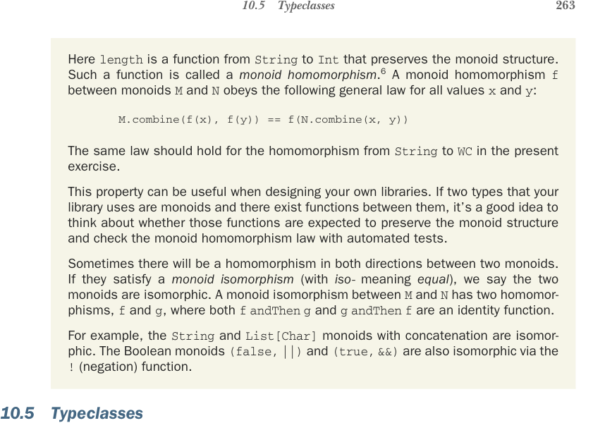
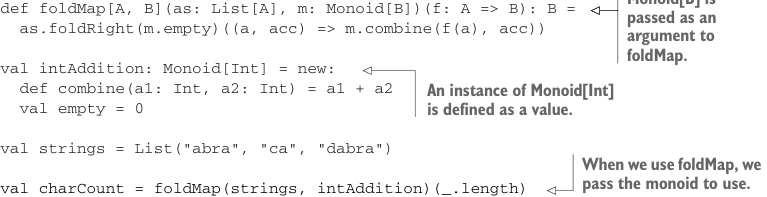
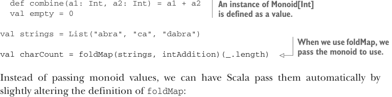

# Страница 0292
[<- Страница 0291](./page-0291) | [Индекс страниц](./) | [Страница 0293 ->](./page-0293)

> Часть 3: Общие структуры в функциональном дизайне / Глава 10: Моноиды / 10.5 Типклассы



## 263 10.5 Типклассы

Здесь `length` — это функция от `String` к `Int`, которая сохраняет структуру моноида,  
как будто не ебёт мозги ассоциативности и единице. Такая херня называется  
*гомоморфизмом моноидов*<sup>6</sup>. Гомоморфизм моноида `f` между моноидами `M` и `N`  
повинуется этому общему закону для всех значений `x` и `y` — ну, типа, как в жизни,  
где комбайн из одного ангара в другой не должен терять колёса по дороге:

```scala
M.combine(f(x), f(y)) == f(N.combine(x, y))
```

Тот же закон должен работать для гомоморфизма от `String` к `WC` в этой задаче прямо сейчас.

Эта хуйня реально выручает, когда сам клепаешь библиотеки. Если два типа в твоей либе — моноиды,  
и между ними есть функции, то подумай, ожидается ли, что они сохранят моноидную структуру,  
и проверь закон гомоморфизма автоматическими тестами — чтоб не было сюрпризов в проде,  
как у тех дебилов, что забыли про ассоциативность.

Бывает, гомоморфизм работает в обе стороны между двумя моноидами. Если они удовлетворяют  
*изоморфизму моноидов* (где *iso-* значит «равные», как два кота под одним хвостом),  
то говорим, что моноиды изоморфны. Изоморфизм моноидов между `M` и `N` имеет два гомоморфизма,  
`f` и `g`, где и `f andThen g`, и `g andThen f` — это функция-идентичность,  
чистая, как слеза девственницы.

Например, моноиды `String` и `List[Char]` с конкатенацией — изоморфны, как сиамские близнецы.  
Булевые моноиды `(false, ||)` и `(true, &&)` тоже изоморфны через функцию `!`  
(negation — отрицание, инверсия, как в матрице).

### 10.5 Типклассы<sup>6</sup>

Все моноиды, что мы пока ковыряли, были простыми значениями и функциями.  
Универсальные функции вроде `foldMap`, которые юзают моноиды, определялись  
с передачей этих моноидов как аргументов. Взгляни на пример:


> Значение типа `Monoid[B]` передаётся как аргумент в `foldMap`.

```scala
def foldMap[A, B](as: List[A], m: Monoid[B])(f: A => B): B =
as.foldRight(m.empty)((a, acc) => m.combine(f(a), acc))
```



```scala
val intAddition: Monoid[Int] = new:
def combine(a1: Int, a2: Int) = a1 + a2
val empty = 0
```



> Инстанс `Monoid[Int]` определяется как значение.

```scala
val strings = List("abra", "ca", "dabra")
```

> Когда юзаем `foldMap`, передаём моноид для использования.

```scala
val charCount = foldMap(strings, intAddition)(_.length)
```

Вместо того чтоб таскать значения моноидов вручную, можно заставить Scala сам их подставлять,  
слегка подкрутив определение `foldMap` — и вуаля, магия типклассов:

```scala
def foldMap[A, B](as: List[A])(f: A => B)(using m: Monoid[B]): B =
as.foldRight(m.empty)((a, acc) => m.combine(f(a), acc))
```

<sup>6</sup>*Гомоморфизм* от греческого *homo* — «одинаковый», и *morphe* — «форма».

[<- Страница 0291](./page-0291) | [Индекс страниц](./) | [Страница 0293 ->](./page-0293)
