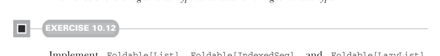

# Страница 0295
[<- Страница 0294](./page-0294) | [Индекс страниц](./) | [Страница 0296 ->](./page-0296)

> Часть 3: Общие структуры в функциональном дизайне / Глава 10: Моноиды / 10.6 Структуры данных Foldable

дальше. Например, если у тебя структура, набитая интежерами, и надо их просуммировать — юзай `foldRight`, как родной:

```scala
ints.foldRight(0)(_ + _)
```

Глядя на этот кусок кода, тебе вообще похуй на тип `ints`. Это может быть `Vector`, `Stream`, `List` или любая хуйня с методом `foldRight`. Эту общую тему мы выдираем в typeclass, чтоб не ебаться:

```scala
trait Foldable[F[_]]:
extension [A](as: F[A])
def foldRight[B](acc: B)(f: (A, B) => B): B
def foldLeft[B](acc: B)(f: (B, A) => B): B
def foldMap[B](f: A => B)(using m: Monoid[B]): B
def combineAll(using m: Monoid[A]): A =
as.foldLeft(m.empty)(m.combine)
```

Тут мы абстрагируемся над type constructor'ом `F` — как ковырялись с типом `Parser` в прошлой главе, помните ту заёбную эпопею? Пишем его как `F[_]`, где подчёркивание орёт: `F` — не полноценный тип, а конструктор, который жрёт ровно один type argument. Как функции, жрущие другие функции, зовутся *higher-order functions*, так и `Foldable` — это *higher-kinded type* или *higher-order type constructor*.^9 Типа, Scala не даёт тебе просто так ебать мозги компилятору без kinds.



#### УПРАЖНЕНИЕ 10.12

Заточите `Foldable[List]`, `Foldable[IndexedSeq]` и `Foldable[LazyList]`. Помните, что `foldRight`, `foldLeft` и `foldMap` можно слепить друг из друга, но это не всегда самый быстрый вариант — иногда лучше вручную, чтоб не просрать перфоманс.


#### УПРАЖНЕНИЕ 10.13

Вспомните бинарный тип данных `Tree` из главы 3. Слепите для него инстанс `Foldable`:

```scala
enum Tree[+A]:
case Leaf[A](value: A)
case Branch[A](left: Tree[A], right: Tree[A])
```

^9 Как значения и функции имеют типы, так и типы с type constructors имеют *kinds*. Scala юзает kinds, чтоб трекать, сколько type arguments жрёт конструктор, кововариантный он или контрвариантный в аргументах, и какие это аргументы вообще.

[<- Страница 0294](./page-0294) | [Индекс страниц](./) | [Страница 0296 ->](./page-0296)
