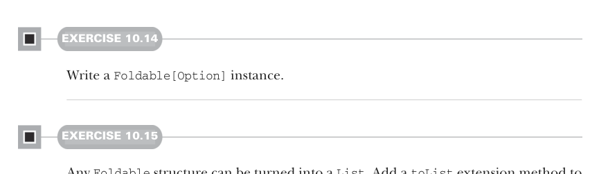

# Страница 0296

[<- Страница 0295](./page-0295) | [Указатель страниц](./) | [Страница 0297 ->](./page-0297)

> Часть 3: Общие структуры в функциональном дизайне / Глава 10: Моноиды / 10.7 Составление моноидов / 10.7.1 Сборка более сложных моноидов

## 267 10.7 Составление моноидов



#### УПРАЖНЕНИЕ 10.14

Накидай инстанс `Foldable[Option]`.

#### УПРАЖНЕНИЕ 10.15

Любую структуру `Foldable` можно слепить в `List`, как конструктор. Добавь extension-метод `toList` в трейт `Foldable` и реализуй его на других методах из `Foldable`, чтоб всё работало как часы:

```scala
trait Foldable[F[_]]:
  extension [A](as: F[A])
    def toList: List[A] = ???
```

### 10.7 Составление моноидов

Абстракция `Monoid` сама по себе — не фонтан, скучновато, бля. С обобщённым `foldMap` чуток поживее, но всё равно не то. А вот настоящая мощь моноидов выстреливает, когда они *компонуются*, как лего-блоки в руках у ребёнка с 16-летним стажем. Если типы `A` и `B` — моноиды, то их кортеж `(A, B)` тоже моноид (это их *произведение* (product), чтоб не путаться).


#### УПРАЖНЕНИЕ 10.16

Реализуй `productMonoid` через product моноидов `ma: Monoid[A]` и `mb: Monoid[B]`. И заметь: твоя реализация `combine` ассоциативна, покуда `ma.combine` и `mb.combine` не подведут с ассоциативностью — классика, через которую все проходят на код-ревью:

```scala
given productMonoid[A, B](
  using ma: Monoid[A], mb: Monoid[B]
): Monoid[(A, B)] with
  def combine(x: (A, B), y: (A, B)) = ???
  val empty = ???
```

### 10.7.1 Сборка более сложных моноидов

Некоторые дата-структуры сами слепляются в забавные моноиды, стоит только их элементам быть моноидами — как матрёшка в матрёшке. Например, моноид для мержа мап ключ-значение `Map` (Map) существует, если value-тип — моноид, и никаких подвохов.

[<- Страница 0295](./page-0295) | [Указатель страниц](./) | [Страница 0297 ->](./page-0297)
