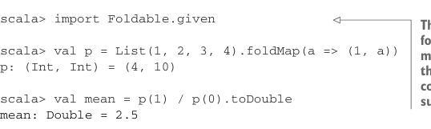

# Страница 0298

[<- Страница 0297](./page-0297) | [Индекс страниц](./) | [Страница 0299 ->](./page-0299)

> Часть 3: Общие структуры в функциональном дизайне / Глава 10: Монаоиды / 10.8 Заключение

## 269 10.8 Заключение


#### УПРАЖНЕНИЕ 10.17

Напишите инстанс монаоида для функций, чьи результаты сами по себе монаоиды. 
Это как если бы твоя функция возвращала не просто число, а целый монаоидальный артефакт, 
который можно комбайнить с другими — чистый FP-кек:

```scala
given functionMonoid[A, B](using mb: Monoid[B]): Monoid[A => B] with
  def combine(f: A => B, g: A => B): A => B = ???
  val empty: A => B = ???
```


#### УПРАЖНЕНИЕ 10.18

Bag — это как set (множество), только вместо уникальности мультиset (мульти-множество): 
представлен map (мапой), где ключ — элемент, а значение — сколько раз эта хрень повторяется. 
Типа, не строгий set (множество), а мешок с дубликатами, чтоб жизнь не казалась сахарной. Например:

```scala
scala> bag(Vector("a", "rose", "is", "a", "rose"))
res0: Map[String,Int] = Map(a -> 2, rose -> 2, is -> 1)
```

Используйте монаоиды, чтоб вычислить bag из `IndexedSeq`. 
Это классика: фолдь по последовательности и собирай частоты, 
как в старом добром word count на Hadoop, только без MapReduce-ебли:

```scala
def bag[A](as: IndexedSeq[A]): Map[A, Int]
```

### 10.7.2 Использование составных монаоидов для слияния траверсалов

Фишка, что куча монаоидов можно слепить в один продукт, позволяет параллельно жарить 
несколько расчётов при фолде структуры данных. Например, длину и сумму листа взять одновременно, 
чтоб среднее посчитать — без лишних проходов, чистый fusion (фьюжн), как в оптимизаторе компилятора:



```scala
scala> import Foldable.given
```

> Это импортирует extension-метод `foldMap`. Если забудешь — компилятор как заботливая мамка подскажет, не ссы.

```scala
scala> val p = List(1, 2, 3, 4).foldMap(a => (1, a))
p: (Int, Int) = (4, 10)
scala> val mean = p(1) / p(0).toDouble
mean: Double = 2.5
```

Мы фолдим с продуктовым монаоидом из двух аддитивных `int`-монаоидов. 
Собирать такой инстанс руками — это как вручную парсить JSON без Circe, пиздец тоскливо. 
Но Scala сам его выведет за нас, спасибо базовым инстансам (`productMonoid` и `intAddition` из компаньона `Monoid`). 
Автомагия в деле, пацаны.

### 10.8 Заключение

Цель части 3 — приучить вас к абстрактным структурам, чтоб вы их чуяли за версту, 
как старый волк в FP-лесу. В этой главе мы разобрали одну из самых простых чисто алгебраических абстракций: монаоид. 
Начнёте высматривать — и в своих либах нихуя не найдёте, где бы не заюзать монаоидальную структуру. 
Это как мем с "everywhere you look", только вместо котов — `combine` и `empty`.

[<- Страница 0297](./page-0297) | [Индекс страниц](./) | [Страница 0299 ->](./page-0299)
