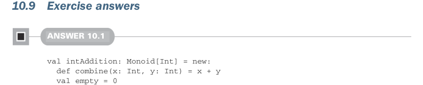

# Страница 0300

[<- Страница 0299](./page-0299) | [Индекс страниц](./) | [Страница 0301 ->](./page-0301)

> Часть 3: Общие структуры в функциональном дизайне / Глава 10: Монойды / 10.9 Ответы на упражнения

## 271 Ответы на упражнения 10.9

- Тип-класс (typeclass) `Foldable` описывает конструкторы типов, которые умеют сворачивать элементы в итоговое значение — то бишь, поддерживают `foldLeft`, `foldRight`, `foldMap` и `combineAll`. Короче, классика фолдинга, без которой никуда в FP.



### 10.9 Ответы на упражнения

#### ОТВЕТ 10.1

```scala
val intAddition: Monoid[Int] = new:
def combine(x: Int, y: Int) = x + y
val empty = 0
val intMultiplication: Monoid[Int] = new:
def combine(x: Int, y: Int) = x * y
val empty = 1
val booleanOr: Monoid[Boolean] = new:
def combine(x: Boolean, y: Boolean) = x || y
val empty = false
val booleanAnd: Monoid[Boolean] = new:
def combine(x: Boolean, y: Boolean) = x && y
val empty = true
```


#### ОТВЕТ 10.2

Давай начнём с голого скелета реализации, чтоб понять, где собака зарыта:

```scala
def optionMonoid[A]: Monoid[Option[A]] = new:
def combine(x: Option[A], y: Option[A]) = ???
val empty = ???
```

Эта сигнатура типа нас конкретно прижимает к стенке. Взгляни, чего у нас вообще нет под рукой:

- Нет ни хуя способа слепить значение типа `A`.
- Нет способа модифицировать значение типа `A`.
- Нет способа склеить несколько значений типа `A` в одно новое.

С этими ограничениями в башке реализуем `empty` и `combine`. Для `empty` нужно выдать `Option[A]`, которая identity для нашей операции `combine`. Могли бы запихнуть `None` или `Some`, но поскольку хуй знает, как сгенерить значение типа `A` для обёртки в `Some`, то вынуждены возвращать чистый `None`. А теперь `combine`? Три сценария на размышление: оба входа `None`, оба `Some`, или один `None`, а другой `Some`:

[<- Страница 0299](./page-0299) | [Индекс страниц](./) | [Страница 0301 ->](./page-0301)
