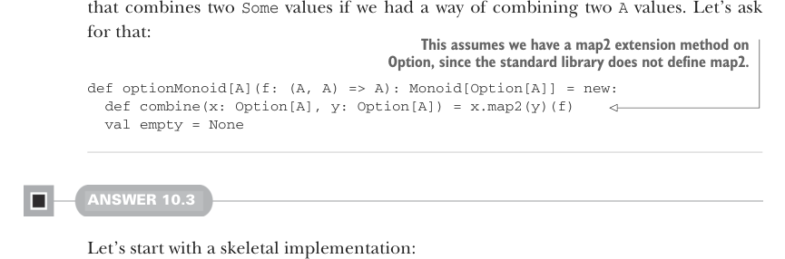

# Страница 0302
[<- Страница 0301](./page-0301) | [Индекс страниц](./) | [Страница 0303 ->](./page-0303)

> Часть 3: Общие структуры в функциональном дизайне / Глава 10: Моноиды / 10.9 Ответы на упражнения

## 273 10.9 Ответы на упражнения



которая комбинирует два значения `Some`, если б у нас был способ слепить два значения `A`. Давай потребуем эту хрень прямо сейчас:

> Это предполагает, что у нас есть метод расширения map2 (map2) для Option — стандартная либа его не предоставляет, сам понимаешь.

```scala
def optionMonoid[A](f: (A, A) => A): Monoid[Option[A]] = new:
  def combine(x: Option[A], y: Option[A]) = x.map2(y)(f)
  val empty = None
```

#### ОТВЕТ 10.3

Начнём с голого скелета реализации, пацаны, чтоб костяк накидать:

```scala
def endoMonoid[A]: Monoid[A => A] = new:
  def combine(f: A => A, g: A => A): A => A = ???
  val empty: A => A = ???
```

Для `empty` возвращаем функцию из `A` в `A` — зная то, что знаем (точнее, чего нахуй не знаем), единственный вариант — identity-функция (identity function), как в меме про "ничего не делай, и всё будет ок". Для `combine` у нас пара функций из `A` в `A`, компонуем их по-старому: либо сначала `f`, потом `g`, либо наоборот, как в танце с бубном. Какую ни выбери — с `dual` из 10.2 слепишь вторую, чистая пост-ирония FP:

```scala
def endoMonoid[A]: Monoid[A => A] = new:
  def combine(f: A => A, g: A => A): A => A = f andThen g
  val empty: A => A = identity
```


#### ОТВЕТ 10.4

Пишем две проперти (properties) — одну под ассоциативность, вторую под тождество, чтоб моноид не подложил свинью в проде. Для ассоциативности генерим три значения и проверяем, что их комбо не зависит от скобок, как в групповухе: используем `**` на `Gen` (Gen), чтоб не ебаться вручную. А тождество — генерим одно значение и убеждаемся в следующем:

- Комбо с empty даёт то же значение, без сюрпризов
- Комбо empty слева — то же самое, симметрия как в жизни

```scala
import fpinscala.testing.{Prop, Gen}
import Gen.`**`

def monoidLaws[A](m: Monoid[A], gen: Gen[A]): Prop =
  val associativity = Prop
    .forAll(gen ** gen ** gen):
    case a ** b ** c =>
```

[<- Страница 0301](./page-0301) | [Индекс страниц](./) | [Страница 0303 ->](./page-0303)
