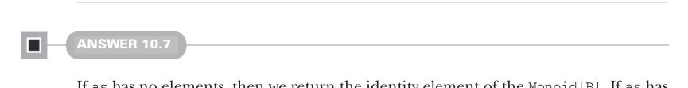
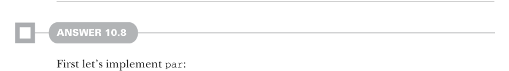

# Страница 0304
[<- Страница 0303](./page-0303) | [Индекс страниц](./) | [Страница 0305 ->](./page-0305)

> Часть 3: Общие структуры в функциональном дизайне / Глава 10: Монойды / 10.9 Ответы на упражнения

## 275 10.9 Ответы на упражнения

Имплементация `foldLeft` идёт по той же схеме, что и раньше, но параметры `f` 
переворачиваем задом наперёд, чтоб не запутаться в ассоциативности, и композицию 
функций держим в первозданном порядке — как в том классическом танце с функторами, 
где каждый шаг на своём месте:

```scala
def foldLeft[A, B](as: List[A])(acc: B)(f: (B, A) => B): B =
  foldMap(as, endoMonoid)(a => b => f(b, a))(acc)
```



#### ОТВЕТ 10.7

Если в `as` элементов ноль — возвращаем нейтралку из `Monoid[B]`, ту самую единицу, 
которая ни хуя не меняет. Если ровно один — просто кидаем его в `f` и ловим результат. 
А если два или больше, режем `as` пополам, как пиццу на код-ревью, и через `Monoid[B]` 
склеиваем рекурсивные вызовы `foldMapV` на каждой половине — классика 
divide-and-conquer (разделяй и властвуй), чтоб стек не переполнился, как в старых 
императивных рекурсиях:

```scala
def foldMapV[A, B](as: IndexedSeq[A], m: Monoid[B])(f: A => B): B =
  if as.length == 0 then
    m.empty
  else if as.length == 1 then
    f(as(0))
  else
    val (l, r) = as.splitAt(as.length / 2)
    m.combine(foldMapV(l, m)(f), foldMapV(r, m)(f))
```



#### ОТВЕТ 10.8

Сначала заимплиментим `par`, без лишнего пиздеца:

```scala
def par[A](m: Monoid[A]): Monoid[Par[A]] = new:
  def combine(a1: Par[A], a2: Par[A]) = a1.map2(a2)(m.combine)
  val empty = Par.unit(m.empty)
```

В тельце `combine` у нас два `Par[A]` и `m.combine` с типом `(A, A) => A` — берём 
`map2` на `Par`, чтоб это дело слепить в один параллельный комбайн. В `empty` хватаем 
пустышку из оригинального монады и поднимаем её в `Par` через `unit`, как лифт в 
небоскрёб асинхронности. Теперь `parFoldMap`: хотим, чтоб и трансформация каждого 
элемента (*map*), и редукция результатов (*reduce*) летели параллельно, как в том 
меме про "параллельный парсинг, где все ждут xN speedup". Первый кусок — через 
`parMap` из седьмой главы, который мы там на коленке слепили. Потом редуцим 
получившийся `Par[IndexedSeq[B]]` в `Par[B]` с помощью `foldMapV` — и вуаля, 
монойд в параллельном потоке, без deadlock'ов (deadlock'ов) и race conditions 
(гонок условий), если всё по уму:

```scala
def parFoldMap[A, B](as: IndexedSeq[A], m: Monoid[B])(f: A => B): Par[B] =
  Par.parMap(as)(f).flatMap(bs =>
    foldMapV(bs, par(m))(b => Par.lazyUnit(b))
  )
```

[<- Страница 0303](./page-0303) | [Индекс страниц](./) | [Страница 0305 ->](./page-0305)
