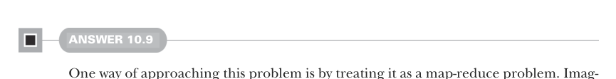
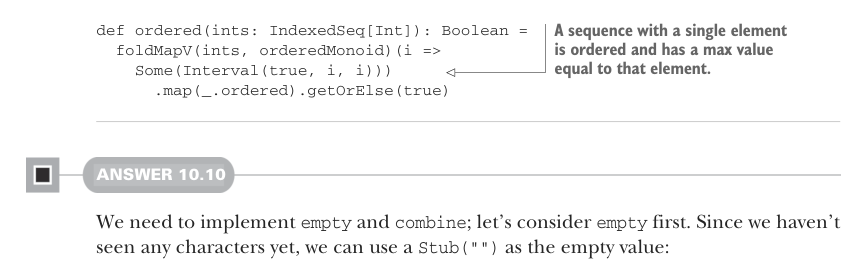

# Страница 0305

[<- Страница 0304](./page-0304) | [Индекс страниц](./) | [Страница 0306 ->](./page-0306)

> Часть 3: Общие структуры в функциональном дизайне / Глава 10: Монойды / Ответы на упражнения 10.9



#### ОТВЕТ 10.9

Один из способов вгрызться в эту задачу — представить её как классический map-reduce (map-reduce), будто режешь последовательность пополам, как арбуз на код-ревью, проверяешь каждую половину на сортировку, а потом склеиваешь вердикты в финальный приговор. 

Как склеивать? Общая последовательность упорядочена, если обе половины в ажуре и максимум слева не переваливает за минимум справа. 

Короче, нужен монойд, который следит за порядком и держит мин/макс в интервале на поводке. Замутим свежий case class, пацаны:


> Определяя Monoid[Option[Interval]] вместо Monoid[Interval], мы можем выставить empty как None — чистый хак, чтоб не ебаться с sentinel-значениями (sentinel values).

```scala
case class Interval(ordered: Boolean, min: Int, max: Int)
val orderedMonoid: Monoid[Option[Interval]] = new:
def combine(oa1: Option[Interval], oa2: Option[Interval]) =
(oa1, oa2) match
case (Some(a1), Some(a2)) =>
Some(Interval(
a1.ordered && a2.ordered && a1.max <= a2.min,
a1.min, a2.max))
case (x, None) => x
case (None, x) => x
val empty = None
```

> Слитая последовательность в порядке, если оба входа не подведут и макс слева <= мин справа. Заодно перевычисляем общий макс — чтоб жизнь малиной не казалась.

Теперь этот монойд можно запустить с `foldMap`, `foldMapV` или `parFoldMap` — все выплюнут один и тот же результат, но с разным уровнем жара в процессоре. 

Каждый инт перетрем в `Option[Interval]`, а когда `foldMapV` отстреляется, размотаем опцию и выкинем мин/макс в помойку:



```scala
def ordered(ints: IndexedSeq[Int]): Boolean =
foldMapV(ints, orderedMonoid)(i =>
Some(Interval(true, i, i)))
.map(_.ordered).getOrElse(true)
```

> Последовательность с одним элементом — само собой отсортирована, и макс равен этому лузеру.

#### ОТВЕТ 10.10

Нам надо забабахать `empty` и `combine`; начнём с пустышки. 

Символов ещё не нюхали, так что `Stub("")` — идеальный заглушка, как кофе без кофеина на дедлайне:

```scala
val wcMonoid: Monoid[WC] = new:
val empty = WC.Stub("")
```

Теперь `combine`. У нашего ADT два кейса — `Stub` и `Part`, — так что комбайн должен перелопатить все четыре комбо: stub со stubом, stub с part'ом, part со stubом и part с part'ом. 

Это как тетрис с монойдами, накидаем схемку:

[<- Страница 0304](./page-0304)  
[Индекс страниц](./)  
[Страница 0306 ->](./page-0306)
