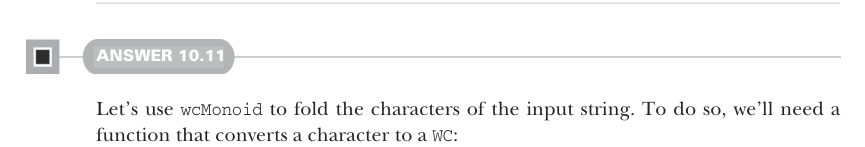

# Страница 0307

[<- Страница 0306](./page-0306)  
[Индекс страниц](./)  
[Страница 0308 ->](./page-0308)

> Часть 3: Общие структуры в функциональном дизайне / Глава 10: Моноиды / 10.9 Ответы на упражнения

Давай теперь потестируем нашу имплементацию, пацаны:

```scala
scala> monoidLaws(wcMonoid, wcGen).run()
+ OK, passed 100 tests.
```

А теперь вернёмся к нашей реализации `empty`. Вместо того чтобы лепить `empty` как какую-то заглушку на коленке, не могли бы мы определить его как `Part`, который ни хуя слов не видал? Давай попробуем, авось прокатит:

```scala
val wcMonoid: Monoid[WC] = new Monoid[WC]:
  val empty = WC.Part("", 0, "")
  ...
```

Запускаем тесты и смотрим, что вылезет:

```scala
scala> monoidLaws(wcMonoid, wcGen).run()
! Falsified after 0 passed tests:
and-right(identity(Part(07A,1,S)))
```

Закон тождества тут обосрался нахуй. Почему, спрашиваете? Вспомните: закон тождества твердит, что склеивая любое значение с `empty`, должно вылезти то же самое значение, без подвохов. А что происходит, когда мы комбинируем `Stub("a")` с `Part("", 0, "")`? Вылазит `Part("a", 0, "")`, что и близко не равно `Stub("a")`. Классический подвох — empty не пустой, а с "пустыми словами", как будто запятая в меме "ничего не делал, просто сидел".



#### ОТВЕТ 10.11

Давай юзаем `wcMonoid` (word count monoid), чтоб зафолдить символы входной строки. Для этого слепим функцию, которая каждый символ превращает в `WC`:

```scala
def wc(c: Char): WC =
  if c.isWhitespace then
    WC.Part("", 0, "")
  else
    WC.Stub(c.toString)
```

Тут засада небольшая, как в том меме с "неожиданным багом". Если символ — пробельный хуйня (пробел, таб и прочая лабуда), то лепим `Part` с нулевыми словами. Это гарантирует, что пробелы честно разъёбывают непробельные символы при редукции, как ножницы бумагу. С этой функцией фолдим всю строку — вылазит один итоговый `WC`. А потом просто считаем слова в этом `WC`:

```scala
def count(s: String): Int =
  def wc(c: Char): WC =
    if c.isWhitespace then
      WC.Part("", 0, "")
    else
      WC.Stub(c.toString)
  def unstub(s: String) = if s.isEmpty then 0 else 1
```

[<- Страница 0306](./page-0306)  
[Индекс страниц](./)  
[Страница 0308 ->](./page-0308)
