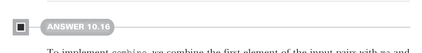

# Страница 0310

[<- Страница 0309](./page-0309) | [Указатель страниц](./) | [Страница 0311 ->](./page-0311)

> Часть 3: Общие структуры в функциональном дизайне / Глава 10: Моноиды / 10.9 Ответы на упражнения

## 281

```scala
case None => acc
case Some(a) => f(a, acc)
override def foldLeft[B](acc: B)(f: (B, A) => B) = as match
case None => acc
case Some(a) => f(acc, a)
override def foldMap[B](f: A => B)(using mb: Monoid[B]): B =
as match
case None => mb.empty
case Some(a) => f(a)
```


#### ОТВЕТ 10.15

```scala
trait Foldable[F[_]]:
extension [A](as: F[A])
def toList: List[A] =
as.foldRight(List.empty[A])(_ :: _)
```

Заметим, пацаны, что эту реализацию `toList` можно затмить (override) прямо в инстансе `Foldable[List]`, вот так, на пальцах:

```scala
given Foldable[List] with
extension [A](as: List[A])
override def foldRight[B](acc: B)(f: (A, B) => B) =
as.foldRight(acc)(f)
override def foldLeft[B](acc: B)(f: (B, A) => B) =
as.foldLeft(acc)(f)
override def toList: List[A] = as
```



#### ОТВЕТ 10.16

Для `combine` берём первую половину входных пар, моноидим её с `ma`, вторую — с `mb`, и возвращаем свежую пару, как из коробки. А `empty` — это просто спарка пустышек от `ma` и `mb`, классический zero (единица, identity) для пары:

```scala
given productMonoid[A, B](
using ma: Monoid[A], mb: Monoid[B]
): Monoid[(A, B)] with
def combine(x: (A, B), y: (A, B)) =
(ma.combine(x(0), y(0)), mb.combine(x(1), y(1)))
val empty = (ma.empty, mb.empty)
```


#### ОТВЕТ 10.17

Типы, как всегда в Scala, всё раскладывают по полочкам: `combine` сливает две функции — `f` и `g` — обе типа `A => B` — в одну монструозную `A => B`. Реализуем через анонимную ламбду, чтоб не париться,

[<- Страница 0309](./page-0309) | [Указатель страниц](./) | [Страница 0311 ->](./page-0311)
