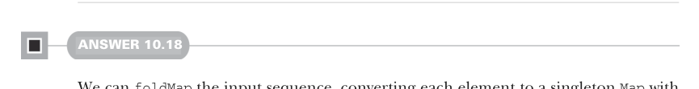

# Страница 0311

[<- Страница 0310](./page-0310) | [Указатель страниц](./) | [Страница 0312 ->](./page-0312)

> Часть 3: Общие структуры в функциональном дизайне / Глава 10: Монойды / 10.9 Ответы на упражнения

которая, как только жрёт значение `A`, запускает и `f`, и `g`, мешает их результаты через поданный `Monoid[B]` — чисто как поварешка в котле монойда. А чтобы заимплементить `empty`, возвращаем анонимную лямбду, которая плюёт на инпут и всегда кидает zero-элемент из `Monoid[B]` — ну, типа, вечный idler (праздный поток) в пуле потоков:

```scala
given functionMonoid[A, B](using mb: Monoid[B]): Monoid[A => B] with
  def combine(f: A => B, g: A => B): A => B =
    a => mb.combine(f(a), g(a))
  val empty: A => B =
    a => mb.empty
```



#### ОТВЕТ 10.18

Можем `foldMap` инпутовую последовательность, лепя из каждого элемента singleton-`Map` (одиночный `Map`), где ключ — сам элемент, а значение — жирная единица. Эти микроскопические мапы сольются в большую кучу через данный `mapMergeMonoid`, подкреплённый `intAddition` для склейки values (значений), — и вуаля, мапа с подсчётом уникалов, как heatmap в Grafana после лога. Только Scala, как слепой котёнок, не знает, где рыть `foldMap` extension method для `Foldable`, так что импортируем синтаксис. Допустим, мы уже задифайнили все `Foldable` given'ы (given-инстансы) в компаньоне `Foldable` — короче, тянем `foldMap` через `import Foldable.given`:

```scala
def bag[A](as: IndexedSeq[A]): Map[A, Int] =
  import Foldable.given
  as.foldMap(a => Map(a -> 1))
```

Альтернативно, могли бы вручную слепить `mapMergeMonoid` и запихнуть его в `foldMapV`, которую мы раньше в этой главе наваяли — без импортов, чисто по-старинке, как в Scala 2, когда given'ы были ещё в утробе:

```scala
def bagManualComposition[A](as: IndexedSeq[A]): Map[A, Int] =
  val bagMonoid = mapMergeMonoid[A, Int](using intAddition)
  foldMapV(as, bagMonoid)(a => Map(a -> 1))
```

[<- Страница 0310](./page-0310) | [Указатель страниц](./) | [Страница 0312 ->](./page-0312)
