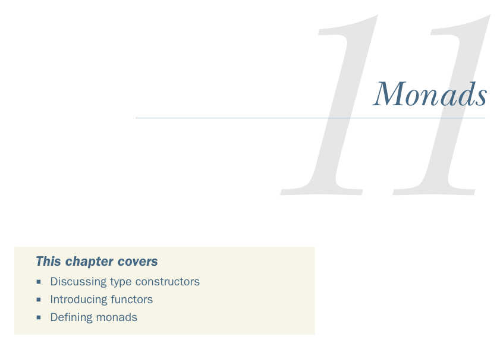

# Страница 0312
[<- Страница 0311](./page-0311) | [Индекс страниц](./) | [Страница 0313 ->](./page-0313)

> Часть 3: Общие структуры в функциональном дизайне / Глава 11: Монды

*Монды*

### Эта глава охватывает

Разбор конструкторов типов

Знакомство с функторами

Определение мондов

В предыдущей главе мы завели простую алгебраическую хрень — моноид. Это был наш первый чистый абстрактный интерфейс, без всякой конкретики, который перевернул наше мышление об интерфейсах с ног на голову, как первый раз когда увидел, что код может жить по законам, а не по фану. Полезный интерфейс — это набор операций, связанных железными законами, чтоб не было бардака. В этой главе продолжим в том же духе, применим к вычесыванию дублирующегося кода из либок, что мы накатали в частях 1 и 2 — ну, вы знаете, когда один и тот же кусок копипастится как вирус. Наткнёмся на два новых абстрактных зверя — `Functor` и `Monad` — и прокачаемся в споте таких паттернов в своём коде, чтоб больше не мучиться с 'а где я это уже видел?'.1

1 Названия *functor* и *monad* из теории категорий — той математической хуйни, где всё про стрелки и объекты, — но без неё ты и главу осилить сможешь, и FP-мастером станешь, я сам без неё 16 лет ебусь в проде. Если жрёт — загляни в рефы в конце главы (https://github.com/fpinscala/fpinscala/wiki).

**283**

[<- Страница 0311](./page-0311) | [Индекс страниц](./) | [Страница 0313 ->](./page-0313)
