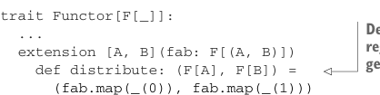

# Страница 0314
[<- Страница 0313](./page-0313) | [Индекс страниц](./) | [Страница 0315 ->](./page-0315)

> Часть 3: Общие структуры в функциональном дизайне / Глава 11: Монады / 11.1 Функторы: Обобщение функции map / 11.1.1 Законы функтора

## 285 11.1 Функторы: Обобщение функции map



```scala
trait Functor[F[_]]:
  ...
  extension [A, B](fab: F[(A, B)])
    def distribute: (F[A], F[B]) =
```

> Определено как метод расширения вместо обычного метода, чтоб юзерам не пришлось вручную хватать инстанс функтора для этой хуйни

```scala
(fab.map(_(0)), fab.map(_(1)))
```

Мы это слепили чисто по типам, как по рельсам катим, но давай разберём на пальцах, че оно значит для реальных типов данных — типа `List`, `Gen`, `Option` и прочей живности. Скажем, если `distribute` функцию `List[(A, B)]` на списке пар, то вылезут два списка одной длины — один со всеми `A`, другой со всеми `B`. Эта операция иногда зовётся *unzip* (разорвать паровоз по вагонам). Короче, мы только что наваяли универсальный unzip, который хуярит не только на списках, но на любом функторе (functor)! А когда такая херня на произведении (product), сразу смотрим на opposite — на сумме или копродукте (coproduct):

```scala
trait Functor[F[_]]:
  ...
  extension [A, B](e: Either[F[A], F[B]])
    def codistribute: F[Either[A, B]] =
      e match
        case Left(fa) => fa.map(Left(_))
        case Right(fb) => fb.map(Right(_))
```

А че значит `codistribute` для `Gen`? Если у тебя либо генератор `A`, либо `B`, то лепишь генератор, который выдаёт то `A`, то `B` — смотря какой поймал. Бам, два охуенно общих комбинатора, чисто из абстрактного интерфейса `Functor` (функтор), и юзай их на любом типе, где `map` имплементирован. Я сам через это прошёл — типо, алгебра оживает, а не просто сигнатуры.

### 11.1.1 Законы функтора

Как только лепишь абстракцию вроде `Functor` (функтор), думай не только про абстрактные методы, но и про законы, чтоб имплементации не ебали мозги и вели себя предсказуемо. Законы — на твой вкус,^4^ Scala нихуя не enforc'ит (не навязывает), но без них интерфейс — как дом без фундамента. Важны по двум причинам:

- Законы поднимают интерфейс на новый семантический уровень, где алгебру ковыряешь независимо от конкретных инстансов. Взять продукт `Monoid[A]` (моноид [A]) и `Monoid[B]` для `Monoid[(A, B)]` — законы моноида гарантируют, что fused-операция (объединённая операция) ассоциативна. Хуй знать детали про `A` и `B`, и не надо.

- Конкретнее, комбинаторы пишем, опираясь именно на эти законы от базовых функций интерфейса вроде `Functor`. Примеры ща увидим, не ссы.

^4^ Хотя если ты берёшь имя из матана, типа functor (функтор) или monoid (моноид), то юзай законы, которые там уже прописаны, а не выдумывай велосипед — математика не простит.

[<- Страница 0313](./page-0313) | [Индекс страниц](./) | [Страница 0315 ->](./page-0315)
