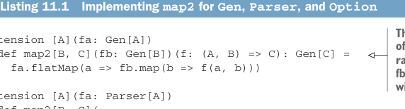

# Страница 0316

[<- Страница 0315](./page-0315) | [Указатель страниц](./) | [Страница 0317 ->](./page-0317)

> Часть 3: Общие структуры в функциональном дизайне / Глава 11: Монады / 11.2 Монады: Обобщение flatMap и unit-функций / 11.2.1 Трейт Monad

## 287 11.2 Монады: Обобщение flatMap и unit-функций

### 11.2 Монады: Обобщение flatMap и unit-функций

``Functor`` — это всего одна из кучи абстракций, которые мы можем вырвать из наших либ и запихнуть в общий котёл. Но ``Functor`` не особо цепляет, потому что полезных операций, которые можно слепить чисто на ``map``, как кот наплакал. Далее разберём куда более сочный интерфейс: ``Monad``. С ним мы реализуем кучу полезных штук раз и навсегда, вынося дублированный код в утиль. Плюс, там законы есть, по которым можно проверить, что твои либы не ебут мозги и работают как часы. Вспомни, для кучи дата-типов из этой книги мы уже лепили ``map2``, чтоб поднять функцию с двумя аргументами. Для ``Gen``, ``Parser`` и ``Option`` функция ``map2`` могла бы выглядеть так.

Листинг 11.1 Реализация ``map2`` для ``Gen``, ``Parser`` и ``Option``



> Это хуярит генератор рандомного C, который прогоняет рандомные генераторы fa и fb, склеивая их результаты функцией f — как два алкаша на районе, вместе бухают и результат делят.

````scala
extension [A](fa: Gen[A])
def map2[B, C](fb: Gen[B])(f: (A, B) => C): Gen[C] =
fa.flatMap(a => fb.map(b => f(a, b)))
extension [A](fa: Parser[A])
def map2[B, C](
fb: Parser[B])(f: (A, B) => C
): Parser[C] =
fa.flatMap(a => fb.map(b => f(a, b)))
````


> Это лепит парсер, который выдаёт C, комбинируя результаты парсеров fa и fb через f — классика, когда два парсера дерутся за вход, а f их мирит.

````scala
extension [A](fa: Option[A])
def map2[B, C](
fb: Option[B])(f: (A, B) => C
): Option[C] =
````

> Это склеивает два Option функцией f, если оба не None; иначе — None, как свидание, где один опоздал, и всё на хуй.

````scala
fa.flatMap(a => fb.map(b => f(a, b)))
````

У этих функций больше общего, чем просто имя — они как близнецы-братья из разных подвыборок. Несмотря на то что дата-типы вроде бы из параллельных вселенных, реализации — один в один, копипаста полная хуйня! Разница только в типе, на котором они крутятся. Это подтверждает то, что мы давно чухали носом: это отдельные случаи одного большого паттерна, как матрёшки в FP. Надо это использовать, чтоб не повторяться, как идиот на пенте. Например, ``map2`` должен писаться один раз на всех, и хватит. Мы тут специально сделали имена uniform, аргументы в одном порядке, чтоб дубликат аж в глаза бил — в реальной жопе на проекте это маскируется хитрее, но чем больше либ пилишь, тем лучше вылавливаешь такие паттерны и выносишь в абстракции, чтоб не ебаться повторно.

### 11.2.1 Трейт Monad

Что роднит ``Parser``, ``Gen``, ``Par``, ``Option`` и кучу других дата-типов, что мы ковыряли, — они все монады, блядь. Как с ``Functor`` и ``Foldable``, лепим Scala-трейт для ``Monad``, который определяет ``map2`` и ещё дохуя функций раз и навсегда, вместо того чтоб копипастить под каждый дата-тип, как лох в 2010-м.

[<- Страница 0315](./page-0315) | [Указатель страниц](./) | [Страница 0317 ->](./page-0317)
