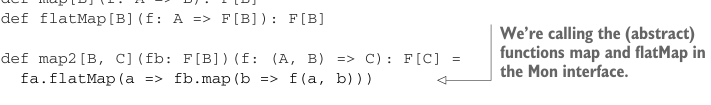

# Страница 0317
[← Страница 0316](./page-0316) | [Указатель страниц](./) | [Страница 0318 →](./page-0318)

> Часть 3: Общие структуры в функциональном дизайне / Глава 11: Монды / 11.2 Монды: Обобщение функций flatMap и unit / 11.2.1 Трейт Monad

В части 2 этой книги мы еблись с отдельными типами данных, выискивая минимальный набор примитивных операций, из которых можно наворотить тучу полезных комбинаторов — как из лего минимальные кубики собираешь целый город. Здесь сделаем то же самое, чтобы отшлифовать *абстрактный* интерфейс до крошечного набора примитива. Начнём с нового трейта, назовём его пока `Mon`. Поскольку знаем, что в итоге хотим `map2` — этот вечный спаситель от комбинаторного ада, — добавим его сразу.

Листинг 11.2. Создаём трейт `Mon` для `map2`


```scala
trait Mon[F[_]]:
extension [A](fa: F[A])
def map2[B, C](fb: F[B])(f: (A, B) => C): F[C] =
```

> Это не скомпилится, потому что map и flatMap не определены в этом контексте. Блядь, классика — Scala орёт, а ты стоишь как лох.

```scala
fa.flatMap(a => fb.map(b => f(a, b)))
```

Здесь мы просто взяли реализацию `map2`, подменили `Parser`, `Gen` и `Option` на полиморфный `F` из интерфейса `Mon[F]` в сигнатуре.<sup>7</sup> Но в этом полиморфном контексте — хуй скомпилится! Мы нихуя не знаем про `F`, так что тем более не в курсе, как `flatMap` или `map` по `F[A]` гонять. Просто добавим `map` и `flatMap` в интерфейс `Mon` и оставим их абстрактными — как чёрный ящик, который инстансы потом заполнят.

Листинг 11.3. Добавляем `map` и `flatMap` в наш трейт

```scala
trait Mon[F[_]]:
extension [A](fa: F[A])
def map[B](f: A => B): F[B]
def flatMap[B](f: A => F[B]): F[B]
```



> Мы вызываем (абстрактные) функции map и flatMap из интерфейса Mon. Типа, "доверьтесь, пацаны, они там есть".

```scala
def map2[B, C](fb: F[B])(f: (A, B) => C): F[C] =
fa.flatMap(a => fb.map(b => f(a, b)))
```

Эта трансляция вышла чисто механической, как копипаст на код-ревью до кофе. Глянули на `map2`, увидели, что она зовёт `map` и `flatMap`, — и добавили их как абстрактные методы в интерфейс. Трейт теперь скомпилится, но не спеши орать "ура, монды в кармане!" и бежать инстансы для `Mon[List]`, `Mon[Parser]`, `Mon[Option]` лепить. Давай уточним примитивы — а то как в том меме про минимально жизнеспособный продукт (MVP, minimum viable product), который разрастается в монстра. Сейчас у нас `map` и `flatMap`, из них `map2` выводится. А минимально ли? Типы, что `map2` имплементили, все имели `unit`, и `map` — это же `flatMap` с `unit` в паре, помните? Например, на `Gen`:

```scala
def map[B](f: A => B): Gen[B] =
flatMap(a => unit(f(a)))
```

<sup>7</sup> Решение назвать аргумент конструктора типа `F` — чисто на отъебись. Могли `Foo`, `w00t` или `Blah2` впихнуть, но по конвенции все нормальные пацаны лепят односимвольные заглавки: `F`, `G`, `H`, а то и `M` с `N` или `P` и `Q`. Я сам в 2008-м ебался с этим, теперь рефлекс.

[← Страница 0316](./page-0316) | [Указатель страниц](./) | [Страница 0318 →](./page-0318)
