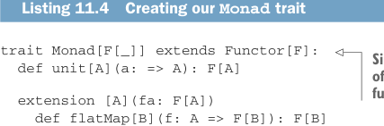
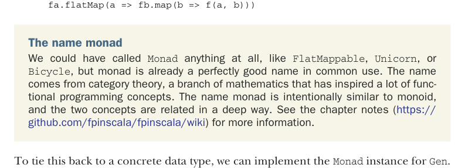
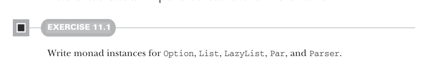

# Страница 0318
[<- Страница 0317](./page-0317) | [Индекс страниц](./) | [Страница 0319 ->](./page-0319)

> Часть 3: Общие структуры в функциональном дизайне / Глава 11: Монды / 11.2 Монды: Обобщаем flatMap и unit / 11.2.1 Трейт Monad

## 289 11.2 Монды: Обобщаем flatMap и unit

Короче, берём `unit` и `flatMap` как нашу минимальную святую пару — без них никуда. Соберём в один загон все типы данных, где эти функции уже болтаются, под единым понятием. Трейт зовётся `Monad` (Monad), `flatMap` и `unit` — абстрактные, а `map` с `map2` уже с дефолтными имплементациями на борту. Типа, закинул два метода — и вся остальная FP-машина завелась.



Листинг 11.4. Рождаем наш трейт `Monad`

```scala
trait Monad[F[_]] extends Functor[F]:
def unit[A](a: => A): F[A]
```

> Поскольку `Monad` сам себе `map` реализует по дефолту, он может `Functor` (Functor) наследовать. Все монды — функторы, но не все функторы — монды, ха-ха, иерархия строгая, как в корпоративной лестнице.

```scala
extension [A](fa: F[A])
def flatMap[B](f: A => F[B]): F[B]
def map[B](f: A => B): F[B] =
flatMap(a => unit(f(a)))
def map2[B, C](fb: F[B])(f: (A, B) => C): F[C] =
```



```scala
fa.flatMap(a => fb.map(b => f(a, b)))
```

Про имя monad. Могли бы окрестить его хоть `FlatMappable`, хоть `Единорогом`, хоть `Велосипедом` — но `monad` уже бренд, прижился в народе. Корни из теории категорий (category theory), той самой матеши, что FP-концепции как на стероидах подсадила. Намекает на `monoid` (monoid), и да, эти двое в одной постели спят, связь глубокая, как корни бамбука. Подробности в нотках главы (https://github.com/fpinscala/fpinscala/wiki).

Чтобы не висеть в облаках, привяжем к конкретике — имплементим `Monad` для `Gen`.

Листинг 11.5. `Monad` для `Gen` на коленке

```scala
object Monad:
given genMonad: Monad[Gen] with
def unit[A](a: => A): Gen[A] = Gen.unit(a)
extension [A](fa: Gen[A])
def flatMap[B](f: A => Gen[B]): Gen[B] =
Gen.flatMap(fa)(f)
```

Тебе только `unit` с `flatMap` допилить — и `map` с `map2` твои на блюдечке с голубой каёмочкой. Сделали один раз и навсегда для любого типа, где `Monad`-инстанс в принципе возможен! Но это только разминка, братаны, впереди ещё тьма функций так же универсально прикрутить можно.



#### УПРАЖНЕНИЕ 11.1

Слепите инстансы монда для `Option`, `List`, `LazyList`, `Par` (Par) и `Parser` (Parser).

[<- Страница 0317](./page-0317) | [Индекс страниц](./) | [Страница 0319 ->](./page-0319)
