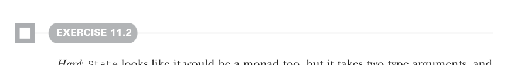
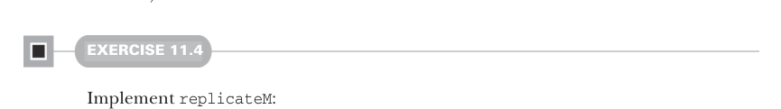

# Страница 0319
[<- Страница 0318](./page-0318) | [Индекс страниц](./) | [Страница 0320 ->](./page-0320)

> Часть 3: Общие структуры в функциональном дизайне / Глава 11: Монды / 11.3 Монодические комбинаторы



#### УПРАЖНЕНИЕ 11.2

*Сложное*: `State` тоже на монду (Monad) смахивает, бля, но жрёт два типа аргумента, а для `Monad` нужен конструктор с одним.  
Попробуй монду для `State` слепить, наткнёшься на проблемы — как кирпичом по яйцам, — и подумай, как выкрутиться.  
Решение разберём позже в главе, не ссы.

### 11.3 Монодические комбинаторы

Теперь, когда базовые примордиалы мондов у нас в кармане, можно нырнуть в архивы прошлых глав и выковырять те функции, что мы ковыряли для каждого монодического контейнера по отдельности.  
Большинство — чистый дубликат-код, как спам в issues, который можно запилить раз и навсегда для всех мондов разом.  
Поехали, пацаны, оптимизируем этот бардак.


#### УПРАЖНЕНИЕ 11.3

Комбинаторы `sequence` и `traverse` тебе уже как старые кенты с код-ревью — знакомы до тошноты, и твои имплементации из прошлых глав, поди, все на одно рыло, с копипастой.  
Слепите их разок на всю катушку прямо на `Monad[F]`:

```scala
def sequence[A](fas: List[F[A]]): F[List[A]]
def traverse[A, B](as: List[A])(f: A => F[B]): F[List[B]]
```

Один комбинатор, что мелькал для `Gen` и `Parser`, — это `listOfN`.  
Он позволял клонировать парсер или генератор `n` раз, чтоб получить парсер или генератор списков ровно такой длины — типа, фабрика клонов в матрице.  
Можем этот трюк заюзать для всех мондов `F`, впихнув в трейт `Monad`.  
И заодно дадим ему универсальное имя посолиднее, типа `replicateM` (читай: *replicate внутри монды*).



#### УПРАЖНЕНИЕ 11.4

Слейпи `replicateM`:

```scala
def replicateM[A](n: Int, fa: F[A]): F[List[A]]
```

[<- Страница 0318](./page-0318) | [Индекс страниц](./) | [Страница 0320 ->](./page-0320)
