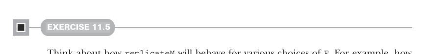

# Страница 0320

[<- Страница 0319](./page-0319)  
[Индекс страниц](./)  
[Страница 0321 ->](./page-0321)

> Часть 3: Общие структуры в функциональном дизайне / Глава 11: Монды / 11.4 Законы монад

## 291

### 11.4 Законы монад



#### УПРАЖНЕНИЕ 11.5

Прикинь, как `replicateM` себя поведёт для всяких вариантов `F` — ну типа, в монаде `List` как оно ебётся? А в `Option`?  
Опиши своими словами, в чём вообще соль этой `replicateM`, как будто пацанам на код-ревью втолковываешь.

Был у нас комбинатор для типа `Gen` — `product`, чтоб два генератора слепить в генератор пар,  
и то же самое провернули для вычислений `Par`. В обоих случаях `product` на `map2` построили,  
так что запросто генерим это дело универсально для любой монады `F`:

```scala
extension [A](fa: F[A]) def product[B](fb: F[B]): F[(A, B)] =
  fa.map2(mb)((_, _))
```


Не обязательно зацикливаться на комбинаторах, что уже видели.  
Кайфово поиграться, покрутить — глядишь, и новые ништяки вылезут, как в старом добром REPL (read-eval-print loop).

#### УПРАЖНЕНИЕ 11.6

*Сложное*: Вот пример функции, которую раньше не ковыряли.  
Реализуй `filterM` — она как `filter`, только вместо обычной функции `A => Boolean`  
у нас монадическая `A => F[Boolean]`.  
(Такая замена обычных (vanilla) на монадические аналоги часто рождает годноту,  
как мем про 'unexpectedly useful'.)  
Слепите её, а потом покумекайте, что она значит для разных типов данных:

```scala
def filterM[A](as: List[A])(f: A => F[Boolean]): F[List[A]]
```

Комбинаторы, что мы тут поковыряли, — лишь малый сэмпл из полной библиотеки,  
которую `Monad` позволяет набросать раз и навсегда, чтоб не ебаться повторно.  
Ещё примеров подкинем в главе 13.

### 11.4 Законы монад

Тут мы законы для интерфейса `Monad` введём.<sup>8</sup>  
Разумеется, functor-законы должны держаться и для `Monad`, ведь `Monad[F]` *это* же `Functor[F]` под капотом,  
но что ещё ждём? Какие законы должны прижать `flatMap` и `unit`,  
чтоб не разъезжалось, как в том меме (meme) про 'works on my machine'?

<sup>8</sup> Эти законы, как всегда, из теории категорий, но без докторской по ней можно въехать в секцию.

[<- Страница 0319](./page-0319)  
[Индекс страниц](./)  
[Страница 0321 ->](./page-0321)
