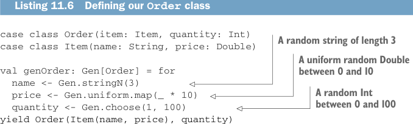

```yaml
---
title: "Страница 0321"
outline: false
---
```

# Страница 0321

[<- Страница 0320](./page-0320)  
[Указатель страниц](./)  
[Страница 0322 ->](./page-0322)

> Часть 3: Общие структуры в функциональном дизайне / Глава 11: Монды / 11.4 Законы монад / 11.4.1 Ассоциативный закон

### 11.4.1 Ассоциативный закон

Представь, хочешь слепить три монадических значения в одно жирное — ну и какие два сначала мешать? А принципиально ли это? Чтоб разобраться в этом дерьме, спустимся на миг с абстрактных небес на грешную землю и глянем на простой конкретный пример с монадой `Gen`. Допустим, тестишь систему заказов товаров, и надо накидать моков (mocks) под заказы, чтоб не ебаться с реал-датой. У тебя есть case class `Order` и генератор для неё — классика жанра, как кофе без сахара.



**Листинг 11.6. Определяем наш класс `Order`**

```scala
case class Order(item: Item, quantity: Int)
case class Item(name: String, price: Double)
```

*Случайная строка длиной 3*

*Равномерно случайный Double от 0 до 10*

```scala
val genOrder: Gen[Order] = for
  name     <- Gen.stringN(3)
  price    <- Gen.uniform.map(_ * 10)
  quantity <- Gen.choose(1, 100)
  yield Order(Item(name, price), quantity)
```

*Случайный Int от 0 до 100*

Тут мы генерим `Item` прямо инлайном (inline из `name` и `price`), но бывает, хочешь `Item` отдельно — чтоб переиспользовать, как нормальный пацан. Короче, выдираем её в свой генератор:

```scala
val genItem: Gen[Item] = for
  name <- Gen.stringN(3)
  price <- Gen.uniform.map(_ * 10)
yield Item(name, price)
```

Потом пихаем это в `genOrder`:

```scala
val genOrder: Gen[Order] = for
  item <- genItem
  quantity <- Gen.choose(1, 100)
  yield Order(item, quantity)
```

И это ж должно быть одно и то же, да? Казалось бы, безопасно предположить — но не торопись, братан, как я на первом проде с flatMap'ами обосрался. Не идентичный же код. Давай размотаем обе имплементации `genOrder` в чистые вызовы `map` и `flatMap`, чтоб увидеть, где собака зарыта. В первом случае — просто:

```scala
Gen.nextString.flatMap(name =>
  Gen.nextDouble.flatMap(price =>
    Gen.nextInt.map(quantity =>
      Order(Item(name, price), quantity))))
```

А во втором — вот так (инлайним вызов `genItem`):

[<- Страница 0320](./page-0320)  
[Указатель страниц](./)  
[Страница 0322 ->](./page-0322)
