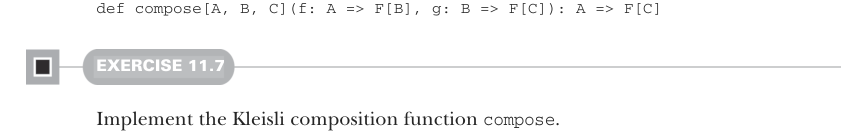
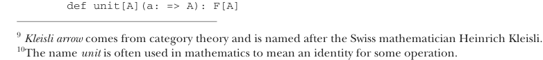

# Страница 0323

[<- Страница 0322](./page-0322) | [Индекс страниц](./) | [Страница 0324 ->](./page-0324)

> Часть 3: Общие структуры в функциональном дизайне / Глава 11: Монады / 11.4 Законы монад / 11.4.3 Законы тождества

КОМПОЗИЦИЯ КЛЕЙСЛИ: АССОЦИАТИВНЫЙ ЗАКОН НА ГЛАЗАХ, КАК БЛЯДЬ Не так просто разглядеть, что закон, о котором мы только что трепались, — это и есть ассоциативный закон. Помните ассоциативный закон для монад? Там всё было заебись прозрачно, как стекло в офисе Google:

```scala
combine(combine(x, y), z) == combine(x, combine(y, z))
```

А вот наш ассоциативный закон для монад — сплошная хуйня нечитаемая! К счастью, есть хак, чтоб его прояснить: вместо монадических значений типа `F[A]` смотрим на монадические функции типа `A` `=>` `F[B]`. Такие функции — это *стрелы Клейсли*⁹, и их можно компоновать друг с дружкой, как лего в руках FP-маньяка:



```scala
def compose[A, B, C](f: A => F[B], g: B => F[C]): A => F[C]
```

#### УПРАЖНЕНИЕ 11.7

Реализуй функцию композиции Клейсли `compose`.

Теперь ассоциативный закон для монад выглядит симметрично, как идеальный код после рефакторинга:


```scala
compose(compose(f, g), h) == compose(f, compose(g, h))
```

#### УПРАЖНЕНИЕ 11.8

*Сложное*: Реализуй `flatMap` через `compose`. Похоже, мы откопали ещё один минимальный набор комбинаторов монады: `compose` и `unit`. Я сам через это ковырялся ночами — подвох в том, что это реально работает в проде.


#### УПРАЖНЕНИЕ 11.9

Докажи, что две формулировки ассоциативного закона — та, что через `flatMap`, и та, что через `compose`, — эквивалентны. Не спи на код-ревью, пацаны.

### 11.4.3 Законы тождества

Остальной закон монады теперь на ладони лежит. Как `empty` был *тождественным элементом* для `combine` в монаде, так и для `compose` в монаде есть свой тождественный элемент. И это именно `unit`, поэтому мы и окрестили операцию так¹⁰ — чтоб не путаться в этой теории категорий, как в спагетти-коде legacy:



```scala
def unit[A](a: => A): F[A]
```

⁹*Стрела Клейсли* — это из теории категорий, в честь швейцарского математика Хайнриха Клейсли.  
¹⁰Имя *unit* в математике часто значит тождество для какой-то операции — классика, блядь.

[<- Страница 0322](./page-0322) | [Индекс страниц](./) | [Страница 0324 ->](./page-0324)
