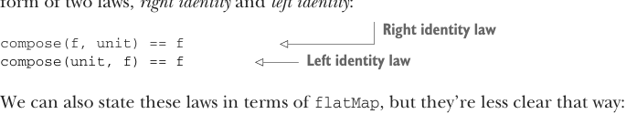
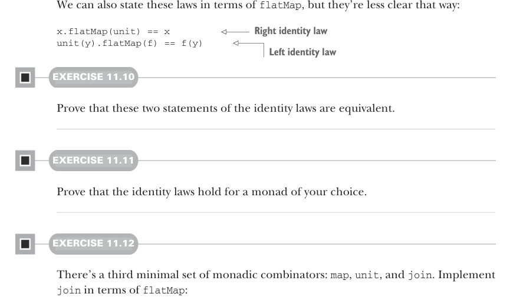
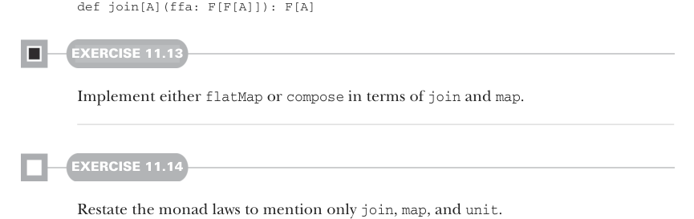

# Страница 0324

[<- Страница 0323](./page-0323) | [Указатель страниц](./) | [Страница 0325 ->](./page-0325)

> Часть 3: Общие структуры в функциональном дизайне / Глава 11: Монады / 11.4 Законы монад / 11.4.3 Законы тождества

## 295 11.4 Законы монад

Эта функция имеет тип, чтоб её впихнуть в аргумент `compose`.11 Эффект простой, как дважды два: всё, что скомпонуешь с `unit`, остаётся тем же самым, без всяких трансмутаций, будто монада — это зеркало, а не чёрная дыра. Обычно это выражается в двух законах — *правом тождестве* и *левом тождестве*:



> Закон правого тождества

```scala
compose(f, unit) == f
compose(unit, f) == f
```

> Закон левого тождества



Можно эти законы переписать через `flatMap`, но так они как размытый скриншот из старого ЖЖ — хуже видно:

> Закон правого тождества

```scala
x.flatMap(unit) == x
unit(y).flatMap(f) == f(y)
```

> Закон левого тождества

#### УПРАЖНЕНИЕ 11.10

Докажи, что эти две формулировки законов тождества — одно и то же, эквивалентны, без подвохов.

#### УПРАЖНЕНИЕ 11.11

Докажи, что законы тождества держатся для монады на твой выбор. Выбери ту, с которой сам ебёшься в проде.

#### УПРАЖНЕНИЕ 11.12

Есть третий минимальный набор монадических комбинаторов: `map`, `unit` и `join`. Реализуй `join` через `flatMap`:



```scala
def join[A](ffa: F[F[A]]): F[A]
```

#### УПРАЖНЕНИЕ 11.13

Реализуй либо `flatMap`, либо `compose` через `join` и `map`.

#### УПРАЖНЕНИЕ 11.14

Переформулируй законы монад так, чтоб упоминались только `join`, `map` и `unit`.

11Не совсем так, потому что нужна ленивая функция `A` к `F[A]` (это `(=> A) => F[A])`, а в Скале такой тип отличается от обычной `A => F[A]`). Пока забьём на эту хуйню.

[<- Страница 0323](./page-0323) | [Указатель страниц](./) | [Страница 0325 ->](./page-0325)
