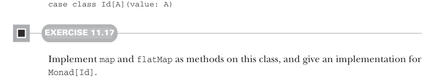

# Страница 0326
[<- Страница 0325](./page-0325) | [Индекс страниц](./) | [Страница 0327 ->](./page-0327)

> Часть 3: Общие структуры в функциональном дизайне / Глава 11: Монды / 11.5 Что же такое монда? / 11.5.1 Монда идентичности

## 297 11.5 Что же такое монда?

Если ты зелёный программер, то к этому моменту ты наелся по самые гланды знаний по кодингу, а это определение ни хуя не стыкуется ни с одним из них — чистый пиздец, как будто из параллельной вселенной. Чтобы реально въехать, что за хуйня творится с мондами, попробуй подумать о них через призму того, что ты уже пережёвывал и проглотил, а потом свяжи это в большую картину. Чтобы накачать интуицию, как бицепс после года в зале, давай глянем на ещё пару мондов и сравним, как они себя ведут — поверь, я сам через это говно прошёл 16 лет назад и до сих пор чешу репу.

### 11.5.1 Монда идентичности

Чтобы выжать монды до их голой сути, без воды и понтов, давай разберём самый простой, но не дебильный экземпляр — **мону идентичности**, которая задаётся вот этим типом:



```scala
case class Id[A](value: A)
```

#### УПРАЖНЕНИЕ 11.17

Реализуй ``map`` и ``flatMap`` как методы этого класса и дай реализацию для ``Monad[Id]``.

``Id`` — это просто тупая обёртка, она нихуя не добавляет, как лишний слой в луковице. Применить ``Id`` к ``A`` — чистая идентичность, потому что обёрнутый тип и голый полностью изоморфны (туда-обратно без единого бита потери, как идеальный мем без компрессии). Но в чём, блядь, смысл этой монды идентичности? Давай потыкаем её в REPL, как палкой в костёр:

```scala
scala> Id("Hello, ").flatMap(a =>
|
Id("monad!").flatMap(b =>
|
Id(a + b)))
res0: Id[String] = Id(Hello, monad!)
```

Когда запишем то же самое через for-comprehension, может проясниться, как после кофе:

```scala
scala> for
|
a <- Id("Hello, ")
|
b <- Id("monad!")
| yield a + b
res1: Id[String] = Id(Hello, monad!)
```

Итак, в чём фишка ``flatMap`` для монды идентичности? Это просто подстановка переменных, как в старом добром императивном коде, только в FP-обёртке. Переменные ``a`` и ``b`` привязываются к ``"Hello,`` ``"`` и ``"monad!"`` соответственно, а потом впихиваются в выражение ``a`` ``+`` ``b``. Могли бы написать то же хуйло без обёртки ``Id``, используя родные переменные Scala — и никто бы не пикнул:

```scala
scala> val a = "Hello, "
a: String = "Hello, "
scala> val b = "monad!"
```

[<- Страница 0325](./page-0325) | [Индекс страниц](./) | [Страница 0327 ->](./page-0327)
