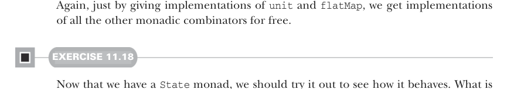
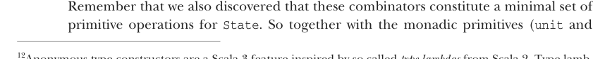

# Страница 0328
[<- Страница 0327](./page-0327) | [Индекс страниц](./) | [Страница 0329 ->](./page-0329)

> Часть 3: Общие структуры в функциональном дизайне / Глава 11: Монады / 11.5 А что такое вообще монада? / 11.5.2 Монада State и частичное применение типов

## 299 11.5 А что такое вообще монада?

Конечно, было бы пиздец как повторчиво, если б нам пришлось вручную строчить отдельный `Monad` инстанс для каждого типа стейта — как копипастить говнокод по сто раз на код-ревью. К счастью, Scala позволяет городить анонимные конструкторы типов. Например, мы могли бы объявить `IntState` прямо инлайном вот так:

```scala
given intStateMonad: Monad[[x] =>> State[Int, x]] with ...
```

Это определяет монаду для анонимного конструктора типов `[x]` `=>>` `State[Int,` `x]` — типа, который жрёт один аргумент типа `x` и возвращает `State[Int,` `x]`. Думай об этом как о типо-уровневом аналоге анонимных ф-ций — те же лямбды, только в типах, чтоб не мучаться с именами. И как анонимки имеют сокращёнку (типа `_` `+` `1` вместо `x` `=>` `x` `+` `1`), так и тут. С опцией компилятора `-Ykind-projector:underscores` мы переписываем `[x]` `=>>` `State[Int,` `x]` как `State[Int,` `_]`.12

Анонимный конструктор типов, объявленный инлайном вот так, в Scala зовётся *type lambda*. Мы юзаем эту фичу, чтоб частично применить `State` и объявить инстанс монады для любого стейта `S`:


```scala
given stateMonad[S]: Monad[[x] =>> State[S, x]] with
def unit[A](a: => A): State[S,A] = State(s => (a, s))
extension [A](st: State[S, A])
def flatMap[B](f: A => State[S, B]): State[S, B] =
```

> Альтернативно, имея stateMonad[S]: Monad[State[S, _]] с …

```scala
State.flatMap(st)(f)
```



Опять же, просто реализуя `unit` и `flatMap`, мы бесплатно получаем все остальные монадические комбинаторы — магия FP, блядь, как в проде копается само.

#### УПРАЖНЕНИЕ 11.18

Теперь, когда у нас есть монада `State`, давай её потыкаем, чтоб понять, как она себя ведёт. Что значит `replicateM` в монаде `State`? Как себя ведёт `map2`? А `sequence`?

Давай теперь разберём разницу между монадой `Id` и монадой `State`. Помнишь, примитивные операции на `State` (кроме монадических `unit` и `flatMap`) — это чтение текущего стейта через `get` и установка нового через `set`:

```scala
def get[S]: State[S, S]
def set[S](s: => S): State[S, Unit]
```



Помнишь, мы ещё открыли, что эти комбинаторы — минимальный набор примитивов для `State`. Так что вместе с монадическими примитивами (`unit` и

12Анонимные конструкторы типов — это фича Scala 3, вдохновлённая так называемыми *type lambdas* из Scala 2. Type lambdas не были запланированной фичей языка, а скорее паттерном, который народ открыл, а потом закодили в популярном kind-projector плагине компилятора.

[<- Страница 0327](./page-0327) | [Индекс страниц](./) | [Страница 0329 ->](./page-0329)
