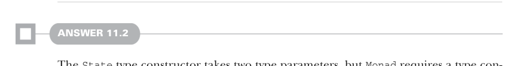

# Страница 0332
[<- Страница 0331](./page-0331) | [Индекс страниц](./) | [Страница 0333 ->](./page-0333)

> Часть 3: Общие структуры в функциональном дизайне / Глава 11: Монды / 11.7 Ответы на упражнения

## 303 11.7 Ответы на упражнения

метод из компаньона `Par`, а не тот, что мы сейчас лепим на `Monad` (иначе зациклимся в бесконечном рекурсивном аде, где `flatMap` будет дрочить сам на себя, пока стек не рухнет к хуям):

```scala
given parMonad: Monad[Par] with
def unit[A](a: => A) = Par.unit(a)
extension [A](fa: Par[A])
override def flatMap[B](f: A => Par[B]): Par[B] =
Par.flatMap(fa)(f)
```

Инстанс `Monad` для парсера слепить посложнее синтаксически из-за трейта `Parsers`. Один хак — функция, которая выдаст инстанс `Monad[P]`, если скормить ей значение типа `Parsers[P]`:

```scala
def parserMonad[P[+_]](p: Parsers[P]): Monad[P] = new:
def unit[A](a: => A) = p.succeed(a)
extension [A](fa: P[A])
override def flatMap[B](f: A => P[B]): P[B] =
p.flatMap(fa)(f)
```



#### ОТВЕТ 11.2

Конструктор типа `State` жрёт два параметра типа, а `Monad` требует конструктор с одним. Можем завести type alias с одним параметром и впихнуть любой тип в `S`:

```scala
type IntState[A] = State[Int, A]
```

Тут мы впарили `Int` в параметр `S`, но похуй, мог бы хоть `Unit`, хоть `Nothing`. С этим алиасом лепим инстанс `Monad[IntState]`:

```scala
given stateIntMonad: Monad[StateInt] with
def unit[A](a: => A) = State(s => (a, s))
extension [A](fa: StateInt[A])
override def flatMap[B](f: A => StateInt[B]) =
State.flatMap(fa)(f)
```

Наша имплементация не учла, что мы инстанцировали `State` с `S` `=` `Int`. Это жирный намёк, что монду можно замутить для любого выбора `S`. Позже в главе разберём, как это провернуть по-умному.


#### ОТВЕТ 11.3

`sequence` можно замутить через `traverse`, просто скормив identity-функцию:

```scala
def sequence[A](fas: List[F[A]]): F[List[A]] =
traverse(fas)(identity)
```

[<- Страница 0331](./page-0331) | [Индекс страниц](./) | [Страница 0333 ->](./page-0333)
