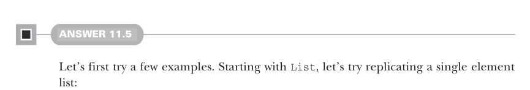

# Страница 0334
[<- Страница 0333](./page-0333) | [Индекс страниц](./) | [Страница 0335 ->](./page-0335)

> Часть 3: Общие структуры в функциональном дизайне / Глава 11: Монды / 11.7 Ответы на упражнения

## 305 11.7 Ответы на упражнения



#### ОТВЕТ 11.5

Давай сперва поковыряем пару примеров руками, чтоб просекли тему. Начнем с `List` — попробуем размножить список из одного элемента, как в репликации ДНК, только без мутаций:

```scala
scala> summon[Monad[List]].replicateM(1, List(1))
val res0: List[List[Int]] = List(List(1))
scala> summon[Monad[List]].replicateM(2, List(1))
val res1: List[List[Int]] = List(List(1, 1))
scala> summon[Monad[List]].replicateM(3, List(1))
val res2: List[List[Int]] = List(List(1, 1, 1))
```

Получаем один элемент на выходе — внутри список ровно той длины, что мы впарили в параметр `n` для `replicateM`. Логично, как дважды два.

Теперь возьми список из двух элементов, чтоб почувствовать размах:

```scala
scala> summon[Monad[List]].replicateM(1, List(1, 2))
val res3: List[List[Int]] = List(List(1), List(2))
scala> summon[Monad[List]].replicateM(2, List(1, 2))
val res4: List[List[Int]] = List(List(1, 1), List(1, 2),
➥ List(2, 1), List(2, 2))
scala> summon[Monad[List]].replicateM(3, List(1, 2))
val res5: List[List[Int]] = List(List(1, 1, 1), List(1, 1, 2),
➥ List(1, 2, 1), List(1, 2, 2), List(2, 1, 1), List(2, 1, 2),
➥ List(2, 2, 1), List(2, 2, 2))
```

Бля, теперь уже толпа списков навалена — каждый внутренний по `n` элементов, как и раньше. Эти внутренние списки — все возможные комбинации с повторениями, будто тянешь упорядоченные тройки из двух значений с возвратом, как в лотерее для ленивых. Короче, `replicateM(n,` `xs)` выдает список размером `xs.size` в степени `n`. Тут 2<sup>3</sup> = 8, пиздец как четко. Проверим гипотезу на свежачок:

```scala
scala> summon[Monad[List]].replicateM(4, List(1, 2, 3)).size
val res6: Int = 81
scala> summon[Monad[List]].replicateM(5, List(1, 2, 3, 4)).size
val res7: Int = 1024
```

43 = 81 и 54 = 1024, так что наша интуиция на коне, как старый мейнфрейм после апгрейда. Теперь глянем на `Option`, чтоб добить картину:

```scala
scala> summon[Monad[Option]].replicateM(0, Some(0))
val res0: Option[List[Int]] = Some(List())
scala> summon[Monad[Option]].replicateM(0, None)
val res1: Option[List[Nothing]] = Some(List())
```

[<- Страница 0333](./page-0333) | [Индекс страниц](./) | [Страница 0335 ->](./page-0335)
