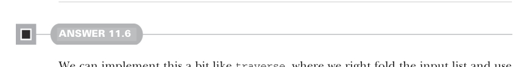
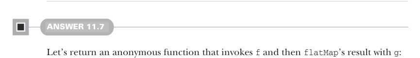

# Страница 0335

[<- Страница 0334](./page-0334) | [Указатель страниц](./) | [Страница 0336 ->](./page-0336)

> Часть 3: Общие структуры в функциональном дизайне / Глава 11: Монды / 11.7 Ответы на упражнения

```scala
scala> summon[Monad[Option]].replicateM(1, Some(1))
val res2: Option[List[Int]] = Some(List(1))
scala> summon[Monad[Option]].replicateM(1, Some(0))
val res3: Option[List[Int]] = Some(List(0))
scala> summon[Monad[Option]].replicateM(1, None)
val res4: Option[List[Nothing]] = None
scala> summon[Monad[Option]].replicateM(2, Some(0))
val res5: Option[List[Int]] = Some(List(0, 0))
scala> summon[Monad[Option]].replicateM(3, Some(0))
val res6: Option[List[Int]] = Some(List(0, 0, 0))
```

Дублируешь `Some(x)` n раз — и вуаля, список из n одинаковых x, весь этот цирк обёрнут в `Some`, как в тёплой грелке. 
А `None` один или больше раз — сплошной `None`, короткое замыкание нахуй. 
Ноль раз для `None` — пустой список в `Some`, типа "типа ничего не трогал". 

`List` и `Option` тут как два брата-близнеца из разных подвалов: один плодится как кролики, другой сразу дохнет. 

Но как описать `replicateM` универсально, чтоб не ебаться с каждым типом по отдельности? 
А так: `replicateM` берёт твою монадическую хрень, размножает её n раз, как вирусы в песочнице, а потом комбайнит всё в одну кучу — и монада сама решает, как эту оргию склеить, по своим правилам.



#### Ответ 11.6

Реализуем это в духе `traverse`: правый фолд по входному списку, `map2` для стыковки накопленного хвоста с текущим элементом — классика жанра. 

Но не как в `traverse`, где всё подряд консим: тут только если предикат орёт "`true`", иначе нахуй. 

А чтоб булевый вердикт из монады вытащить, не церемонимся — `flatMap` в полёт:

```scala
def filterM[A](as: List[A])(f: A => F[Boolean]): F[List[A]] =
as.foldRight(unit(List[A]()))((a, acc) =>
f(a).flatMap(b => if b then unit(a).map2(acc)(_ :: _) else acc))
```



#### Ответ 11.7

Возвращаем анонимку, которая `f` дёргает, а потом результат `flatMap`'ит с `g` — как цепная реакция в домино, без лишнего пиздеца:

```scala
def compose[A, B, C](f: A => F[B], g: B => F[C]): A => F[C] =
a => f(a).flatMap(g)
```

[<- Страница 0334](./page-0334) | [Указатель страниц](./) | [Страница 0336 ->](./page-0336)
