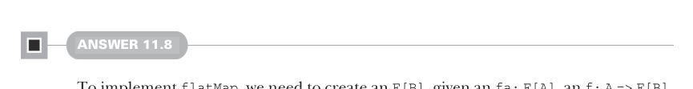
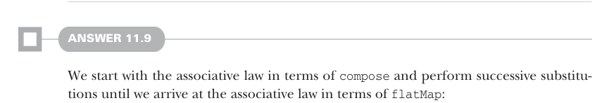
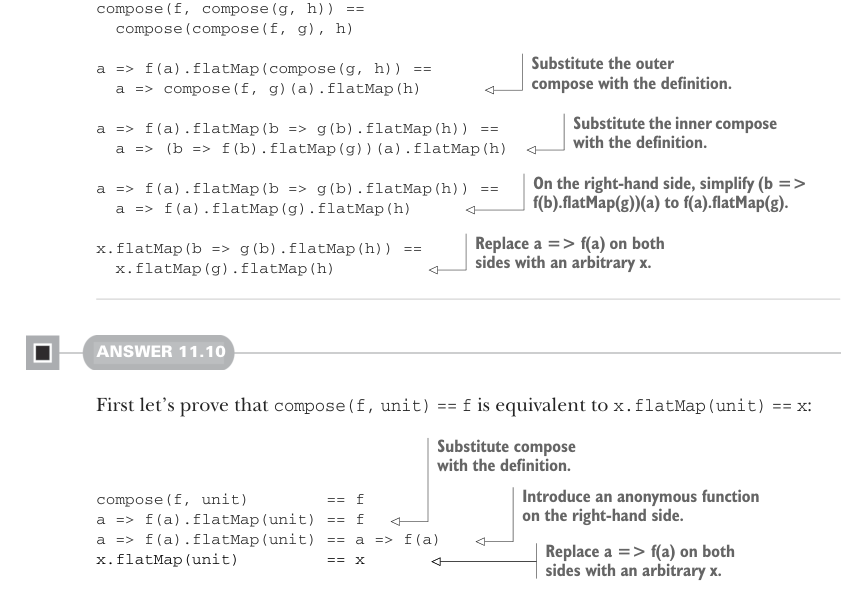

# Страница 0336
[<- Страница 0335](./page-0335) | [Индекс страниц](./) | [Страница 0337 ->](./page-0337)

> Часть 3: Общие структуры в функциональном дизайне / Глава 11: Монды / 11.7 Ответы на упражнения

## 307 11.7 Ответы на упражнения



#### ОТВЕТ 11.8

Чтобы заимплементить `flatMap`, нам нужно слепить `F[B]`, имея под рукой `fa:` `F[A]`, `f:` `A` `=>` `F[B]` и функцию `compose`. `compose` жрёт две функции: `A` `=>` `F[B]` и `B` `=>` `F[C]`. Если б мы могли как-то нагенерить функцию, которая выдаёт `fa`, то закомпозили бы её с `f` — и привет. А такую функцию легко слепить: она берёт любое значение и возвращает `fa`. Композим эту хрень с `f`, кидаем в неё значение — и вуаля, нужный `F[B]` готов, без всякой магии, чисто алгебра:

```scala
extension [A](fa: F[A])
def flatMap[B](f: A => F[B]): F[B] =
compose(_ => fa, f)(())
```



#### ОТВЕТ 11.9

Берём ассоциативный закон в терминах `compose` и делаем последовательные подстановки, пока не приходим к ассоциативному закону в терминах `flatMap` — как в старом добром код-ревью, где разворачиваешь матрёшку до ядра:



```scala
compose(f, compose(g, h)) ==
compose(compose(f, g), h)
```

> Подставляем определение внешнего compose.

```scala
a => f(a).flatMap(compose(g, h)) ==
a => compose(f, g)(a).flatMap(h)
```

> Подставляем определение внутреннего compose.

```scala
a => f(a).flatMap(b => g(b).flatMap(h)) ==
a => (b => f(b).flatMap(g))(a).flatMap(h)
```

> Справа упрощаем (b => f(b).flatMap(g))(a) до f(a).flatMap(g) — ну а чё, очевидка же.

```scala
a => f(a).flatMap(b => g(b).flatMap(h)) ==
a => f(a).flatMap(g).flatMap(h)
```

> Заменяем a => f(a) с обеих сторон на произвольное x — типа, абстрагируемся от конкретики.

```scala
x.flatMap(b => g(b).flatMap(h)) ==
x.flatMap(g).flatMap(h)
```

#### ОТВЕТ 11.10

Сначала докажем, что `compose(f,` `unit)` `==` `f` эквивалентно `x.flatMap(unit)` `==` `x` — шаг за шагом, без фокусов:

> Подставляем определение compose.

> Вводим анонимную функцию справа — чисто для симметрии.

```scala
compose(f, unit)
== f
a => f(a).flatMap(unit) == f
a => f(a).flatMap(unit) == a => f(a)
x.flatMap(unit)
== x
```

> Заменяем a => f(a) с обеих сторон на произвольное x.

[<- Страница 0335](./page-0335) | [Индекс страниц](./) | [Страница 0337 ->](./page-0337)
