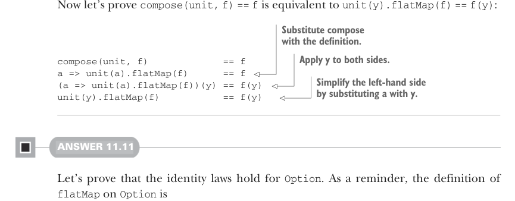

# Страница 0337

[<- Страница 0336](./page-0336) | [Индекс страниц](./) | [Страница 0338 ->](./page-0338)

> Часть 3: Общие структуры в функциональном дизайне / Глава 11: Монды / 11.7 Ответы на упражнения



Теперь давай докажем, что `compose(unit, f) == f` — это одно хуйло с `unit(y).flatMap(f) == f(y)`, чтоб не осталось сомнений, как в том меме про "ничего не понятно, но очень интересно":

> Подставляем определение compose.

> Применяем y с обеих сторон.

```scala
compose(unit, f)
== f
a => unit(a).flatMap(f)
== f
(a => unit(a).flatMap(f))(y) == f(y)
unit(y).flatMap(f)
== f(y)
```

> Упрощаем левую сторону, подставляя a вместо y.

#### ОТВЕТ 11.11

Давай докажем, что законы идентичности работают для `Option`. Напомню, определение `flatMap` на `Option` выглядит так:

```scala
enum Option[+A]:
case Some(get: A)
case None
def flatMap[B](f: A => Option[B]): Option[B] =
this match
case None => None
case Some(a) => f(a)
```

Сначала докажем `compose(f, unit) == f`; это, как вы помните, эквивалентно `x.flatMap(unit) == x`. Когда `x` равно `None`, левая сторона сводится к `None` по определению `flatMap`. Когда `x` равно `Some(a)`, она сводится к `unit(a)`, а `unit(a)` — к `Some(a)`. Теперь докажем `compose(unit, f) == f`; это эквивалентно `unit(y).flatMap(f) == f(y)`. Используя определение `unit`, левая сторона упрощается до `Some(y).flatMap(f)`. А по определению `flatMap` это уже `f(y)`. Короче, как в продакшене: проверил на всех углах — держит.


#### ОТВЕТ 11.12

Можем использовать `flatMap` с функцией-идентичностью, чтоб сплющить вложенные конструкторы типов в один — чистый flatten (сплющивание), как в том старом добром `List.flatten`, который все мы ковыряли до дыр. В Scala это обычно зовётся `flatten`:

```scala
extension [A](ffa: F[F[A]]) def join: F[A] =
ffa.flatMap(identity)
```


#### ОТВЕТ 11.13

```scala
extension [A](fa: F[A])
def flatMapViaJoinAndMap[B](f: A => F[B]): F[B] =
fa.map(f).join
```

[<- Страница 0336](./page-0336) | [Индекс страниц](./) | [Страница 0338 ->](./page-0338)
