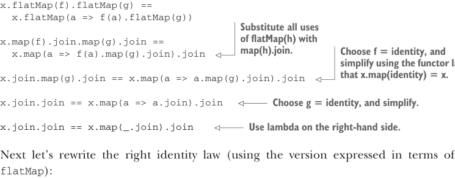
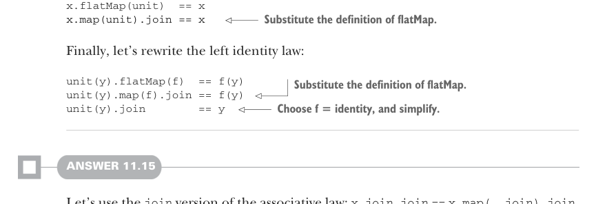

# Страница 0338
[<- Страница 0337](./page-0337) | [Индекс страниц](./) | [Страница 0339 ->](./page-0339)

> Часть 3: Общие структуры в функциональном дизайне / Глава 11: Монады / 11.7 Ответы на упражнения

## 309 11.7 Ответы на упражнения

```scala
def composeViaJoinAndMap[A, B, C](f: A => F[B], g: B => F[C]): A => F[C] =
  a => f(a).map(g).join
```


#### ОТВЕТ 11.14

Пацаны, у нас три закона на перелопачивание: ассоциативный и два тождества — левое и правое. Сначала разберёмся с ассоциативным, как с этой херней, где скобки пляшут.

```scala
x.flatMap(f).flatMap(g) ==
  x.flatMap(a => f(a).flatMap(g))
```



> Подставь везде flatMap(h) на map(h).join. Выбери f = identity, и упрости по functor-закону: x.map(identity) = x, это ж база, как 2+2.

```scala
x.map(f).join.map(g).join ==
  x.map(a => f(a).map(g).join).join

x.join.map(g).join ==
  x.map(a => a.map(g).join).join
```

> Выбери g = identity, и упрости дальше, без соплей.

```scala
x.join.join == x.map(a => a.join).join
```

> Лямбда справа — чисто для красоты.

```scala
x.join.join == x.map(_.join).join
```

Дальше правый закон тождества (в версии через `flatMap`, чтоб не ебаться):



```scala
x.flatMap(unit) == x
x.map(unit).join == x
```

> Подставь определение flatMap, и поехали.

Наконец, левый закон тождества:

```scala
unit(y).flatMap(f) == f(y)
unit(y).map(f).join == f(y)
unit(y).join == y
```

> Подставь определение flatMap.

> Выбери f = identity, упрости — и вуаля.

#### ОТВЕТ 11.15

Берём ассоциативный закон в версии с `join`: `x.join.join` `==` `x.map(_.join).join`. Обратите внимание, `x` тут имеет тип `F[F[F[A]]]`. Для `Par` ассоциативность говорит: если у тебя трёхуровневая параллельная херня, то можно результаты ждать изнутри наружу или снаружи внутрь — результат один хрен тот же, как в меме с котом Шрёдингера, только без яда. Для `Parser` то же самое: в цепочке зависимых парсеров важен только порядок, а не как они вложены, — не еби мозги себе группировкой.

[<- Страница 0337](./page-0337) | [Индекс страниц](./) | [Страница 0339 ->](./page-0339)
