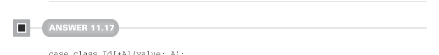

# Страница 0339
[<- Страница 0338](./page-0338) | [Индекс страниц](./) | [Страница 0340 ->](./page-0340)

> Часть 3: Общие структуры в функциональном дизайне / Глава 11: Монады / 11.7 Ответы на упражнения


#### Ответ 11.16

Давай возьмём версии законов идентичности для `flatMap`:

- *Правый закон идентичности* — `x.flatMap (unit)` `==` `x`
- *Левый закон идентичности* — `uint(y).flatMap(f)` `==` `f(y)`

Для `Gen` правый закон означает, что flatMap'ишь unit над генератором — и нихуя не меняется, как будто и не трогал. Левый закон говорит: берёшь произвольное значение, засовываешь в unit, потом flatMap по произвольной функции — и выходит то же самое, что просто значение в функцию засунуть напрямую. Проход через unit-генератор и `flatMap` — чистый воздух, значения генерятся без единой царапины. А для `List` правый закон — это когда flatMap singleton-конструктора по каждому элементу даёт исходный список: `flatMap` не может ни дропнуть, ни отфильтровать, ни как-то извратить элементы, мем про "immutable как скала" в чистом виде. Левый закон добавляет: `flatMap` не может ни набухать список (применяя функцию по сто раз к элементу перед join'ом), ни ссохнуть его — размер на месте, как в immutable-продакшене после всех этих рефакторингов.



#### Ответ 11.17

```scala
case class Id[+A](value: A):
def map[B](f: A => B): Id[B] =
Id(f(value))
def flatMap[B](f: A => Id[B]): Id[B] =
f(value)
object Id:
given idMonad: Monad[Id] with
def unit[A](a: => A) = Id(a)
extension [A](fa: Id[A])
override def flatMap[B](f: A => Id[B]) =
fa.flatMap(f)
```


#### Ответ 11.18

Давай замутим state-action для экспериментов, чтоб пощупать на живом:

```scala
val getAndIncrement: State[Int, Int] =
for
i <- State.get
_ <- State.set(i + 1)
yield i
```

[<- Страница 0338](./page-0338) | [Индекс страниц](./) | [Страница 0340 ->](./page-0340)
