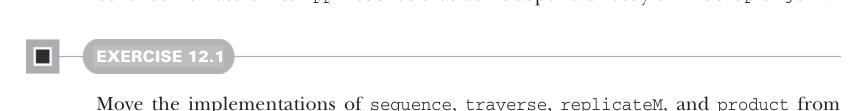
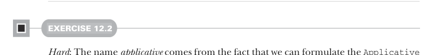

# Страница 0344

[<- Страница 0343](./page-0343) | [Индекс страниц](./) | [Страница 0345 ->](./page-0345)

> Часть 3: Общие структуры в функциональном дизайне / Глава 12: Аппликативные и траверсибельные функторы / 12.2 Трейт Applicative

## 315 12.2 Трейт Applicative

Короче, это значит, что все аппликативы по умолчанию функторы, факт, без вариантов. Мы лепим `map` на базе `map2` и `unit`, как уже не раз делали для конкретных дата-типов — старая добрая схема. Эта имплементация намекает на законы для `Applicative`, которые разберём позже, потому что ждём, что такая реализация `map` структуру не сломает, как и положено по законам `Functor`. Имплементация `traverse` остаётся нетронутой, само собой. Аналогично можем перетащить в `Applicative` другие комбинаторы, которые не зависят напрямую от `flatMap` или `join` — чисто гигиена кода, пацаны.



#### УПРАЖНЕНИЕ 12.1

Вытащите реализации `sequence`, `traverse`, `replicateM` и `product` из `Monad` в `Applicative`, жмякая только на `map2` и `unit` или методы, слепленные из них:

```scala
def sequence[A](fas: List[F[A]]): F[List[A]]
def traverse[A,B](as: List[A])(f: A => F[B]): F[List[B]]
def replicateM[A](n: Int, fa: F[A]): F[List[A]]
extension [A](fa: F[A]) def product[B](fb: F[B]): F[(A, B)]
```



#### УПРАЖНЕНИЕ 12.2

*Хардкор*: Название *applicative* не с потолка взято — интерфейс `Applicative` можно слепить из альтернативного сета примитивов, а именно `unit` и функции `apply`, вместо `unit` и `map2`. Докажите, что выразительная мощь та же, задефинив `map2` и `map` через `unit` и `apply`. Плюс покажите, что `apply` реализуется через `map2` и `unit`:


```scala
trait Applicative[F[_]] extends Functor[F]:
```

> Определи через map2.

```scala
def apply[A, B](fab: F[A => B], fa: F[A]): F[B]
def unit[A](a: => A): F[A]
```

> Определи через apply и unit. Определи через apply и map.

```scala
extension [A](fa: F[A])
def map[B](f: A => B): F[B]
def map2[B, C](fb: F[B])(f: (A, B) => C): F[C]
```

#### УПРАЖНЕНИЕ 12.3

Метод `apply` — это золотая жила для имплементации `map3`, `map4` и прочей хуйни в том же духе, паттерн простой, как дважды два. Слепите `map3` и `map4`, используя только `unit`, `apply` и метод `curried`, который висит на функциях:1

1 Напомню, что если у тебя есть `f:` `(A,` `B)` `=>` `C,`, то `f.curried` имеет тип `A` `=>` `B` `=>` `C`. Метод `curried` существует для функций любой арити в Scala.

[<- Страница 0343](./page-0343) | [Индекс страниц](./) | [Страница 0345 ->](./page-0345)
