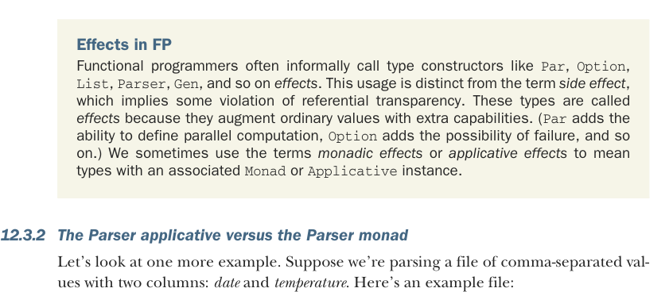

# Страница 0347
[<- Страница 0346](./page-0346) | [Индекс страниц](./) | [Страница 0348 ->](./page-0348)

> Часть 3: Общие структуры в функциональном дизайне / Глава 12: Аппликативные и траверсибельные функторы / 12.3 Разница между монадами и аппликативными функторами / 12.3.2 Аппликативный парсер против монады парсера

Листинг 12.4. Сочетание результатов с монадой `Option`


> ID сотрудника, индексированный по имени сотрудника

> Отдел, индексированный по ID сотрудника

```scala
val idsByName: Map[String, Int] = ...
val depts: Map[Int,String] = ...
val salaries: Map[Int,Double] = ...
val o: Option[String] =
idsByName.get("Bob").flatMap(id =>
depts.get(id).map2(salaries.get(id))(
(dept, salary) => s"Bob in $dept makes $salary per year"
)
)
```

> Зарплаты, индексированные по ID сотрудника

> Ищем ID Боба, а потом используем результат для дальнейших поисков.

Здесь `depts` — это `Map[Int,` `String]`, индексированный по ID сотрудника, который является `Int`. Если хотим вывести отдел и зарплату Боба, то сперва резолвим имя в ID, а потом этим ID лезем в `depts` и `salaries`. С `Applicative` структура вычислений — как рельсы на заводе, жёстко зафиксирована; а с `Monad` результаты прошлых шагов могут рулить, что делать дальше, — чистый пост-ироничный FP-вайб, когда один flatMap ведёт к другому, как домино в аду.



Эффекты в FP Функционалы часто накидывают на конструкторы типов вроде `Par`, `Option`, `List`, `Parser`, `Gen` и прочей хуйни ярлык *эффекты*. Не путайте с *side effect* — это когда референциальная прозрачность в жопу. Эти типы называют *эффектами*, потому что они прокачивают обычные значения допами: `Par` добавляет параллелизм, `Option` — шанс на фейл, и так далее, как скиллы в RPG. Иногда болтаем *монадические эффекты* или *аппликативные эффекты*, имея в виду типы с инстансом `Monad` или `Applicative`.

### 12.3.2 Аппликативный парсер против монады парсера

Давайте ещё один примерец разъебём, пацаны. Допустим, парсим CSV-файлик с двумя колонками: *дата* и *температура*. Вот пример файла:

```scala
1/1/2010, 25
2/1/2010, 28
3/1/2010, 42
4/1/2010, 53
...
```

Если заранее в курсах, что дата идёт первой, температура второй, то просто эту последовательность в `Parser` хардкодим — без лишнего геморроя:

```scala
case class Row(date: Date, temperature: Double)
val d: Parser[Date] = ...
```

[<- Страница 0346](./page-0346) | [Индекс страниц](./) | [Страница 0348 ->](./page-0348)
